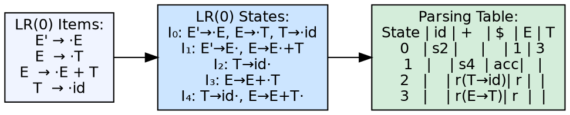
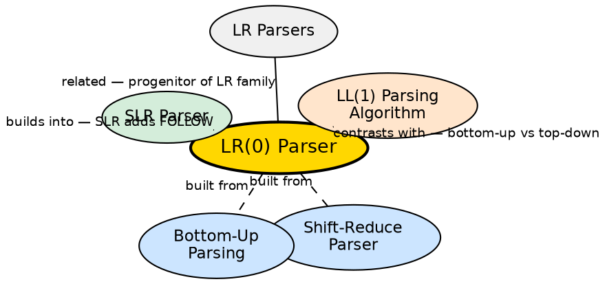

## The Problem

Shift-reduce parsing needs a systematic way to decide when to shift and when to reduce. An LR(0) parser introduces the concept of **LR items** (productions with a dot position indicating how much has been seen) and uses them to build states for a deterministic finite automaton. This provides a formal foundation for all LR parsing variants.

## Core Idea

An LR(0) parser is the simplest LR parser variant. It uses **LR(0) items** — grammar productions with a dot marking the current position — to build a finite automaton. The parser uses the automaton's states and a parsing table derived from them to make shift/reduce decisions. It requires **zero lookahead** tokens for reduce decisions, making it the least powerful but conceptually simplest LR parser.

## How It Works

The parser is built from LR(0) items. An item `A → α·β` means we've seen `α` and expect to see `β`. The closure operation adds items for productions whose left-hand side follows the dot. The goto operation transitions on grammar symbols. The resulting collection of items (LR(0) states) forms the automaton. The ACTION table: shift based on terminal transitions, reduce when a state has a reduce item (a dot at the end), accept when reducing the augmented start symbol. If any state has both shift and reduce items (shift/reduce conflict) or multiple reduce items (reduce/reduce conflict), the grammar is not LR(0).

## Visual Explanation

## Semantic Network

## Key Properties

- **LR(0) items:** Productions with a dot position marking parsing progress
- **Zero lookahead:** Reduce decisions are made without any lookahead information
- **LR(0) automaton:** States are sets of LR(0) items; transitions on grammar symbols
- **Least powerful LR:** Most grammars are not LR(0) — shift/reduce conflicts are common
- **Foundation:** All LR variants (SLR, LALR, CLR) build on the LR(0) item concept

## Connections

- **Built from:** [[shift-reduce-parser|Shift Reduce Parser]] — LR(0) uses shift/reduce operations with formal state tracking
- **Built from:** [[bottom-up-parsing|Bottom-Up Parsing]] — LR(0) is a bottom-up parsing method
- **Builds into:** [[lr-parsers|LR Parsers]] — SLR, LALR, and CLR extend LR(0) with lookahead
- **Contrasts with:** [[predictive-parser|Predictive Parser]] — LR(0) is bottom-up; predictive is top-down
- **Related:** [[lr-parsers|SLR Parser]] — SLR adds FOLLOW-based lookahead to LR(0) for conflict resolution

## Edge Cases & Gotchas

- **Shift/reduce conflicts:** Very common in LR(0) — most real grammars need at least SLR
- **Reduce/reduce conflicts:** Two different productions can be reduced in the same state — ambiguous grammar or design issue
- **LR(0) ⊂ SLR ⊂ LALR ⊂ CLR:** Every LR(0) grammar is SLR, but most practical grammars need LALR or CLR
- **State explosion:** Even LR(0) can produce many states for real grammars — though far fewer than CLR(1)

## Sources

- [[cd2-summary|Compiler Design for GATE Exam]] — covers LR(0) parser as the simplest LR variant
