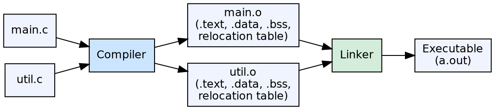

## The Problem

A compiler produces code for a single source file, but real programs consist of many source files compiled separately. The raw machine code from a single compilation cannot execute on its own — it needs to be combined with other modules, have its addresses resolved, and be loaded into memory.

## Core Idea

Object code is the output of the code generation phase before linking. It contains machine instructions (in binary or assembly form) along with metadata: relocation information (which addresses need adjustment when combined), symbol tables (exported and imported symbols), and debugging information. The linker resolves references and produces a final executable.

## How It Works

The compiler produces a relocatable object file (`.o` on Unix, `.obj` on Windows) for each source file. This file has sections for code (`.text`), initialized data (`.data`), uninitialized data (`.bss`), and symbol tables. Addresses in the code are relative or symbolic — the linker fills in actual addresses when it creates the executable.

## Visual Explanation

## Key Properties

- **Not directly executable:** Needs linking before execution
- **Contains metadata:** Relocation info, symbol tables, debug info
- **Relocatable:** Addresses are relative/symbolic, not absolute
- **Section structure:** Code (.text), initialized data (.data), uninitialized data (.bss)
- **Input to linker:** The linker combines multiple object files into an executable

## Connections

- **Built from:** [[code-generation|Code Generation]] — the code generator produces object code
- **Builds into:** [[linker-and-loader|Linker and Loader]] — the linker processes object code into executables
- **Related:** [[phases-of-compiler|Phases of a Compiler]] — object code is the final output of compilation
- **Related:** [[compiler-pass|Compiler Pass]] — object code output depends on whether the compiler uses single or multiple passes

## Edge Cases & Gotchas

- **Position-independent code (PIC):** Shared libraries use PIC where all addresses are relative to the program counter — requires different object code structure
- **Link-time optimization (LTO):** Modern compilers can defer optimization to link time, keeping IR in object files
- **Debug info formats:** DWARF (Unix) or CodeView (Windows) — these can significantly increase object file size

## Sources

- [[compilerdesign-summary|Compiler Design Tutorial]] — introduces object code as the compilation output
