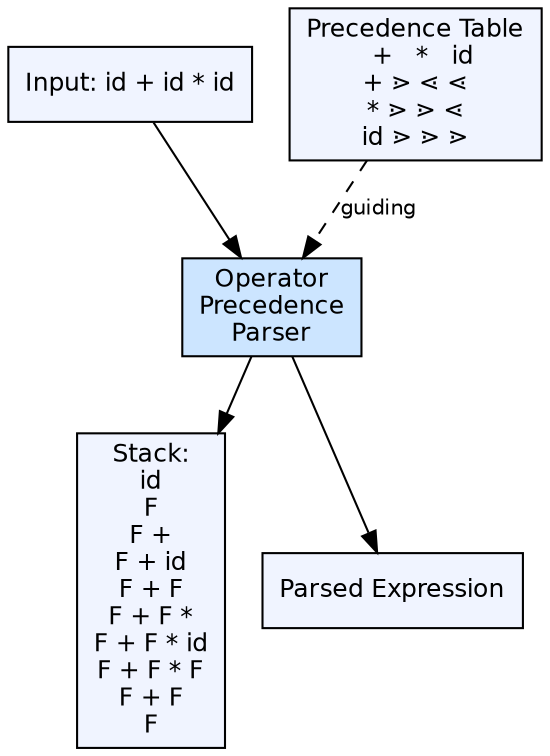

## The Problem

Expression parsing is the most common parsing task, yet full LR parsing is overkill for expression grammars. Expressions follow regular patterns: operators have precedence levels and associativity. A simpler, faster parser can handle expressions efficiently.

## Core Idea

An operator precedence parser is a bottom-up parser designed for **operator grammars** (grammars with no production right-hand side having two adjacent non-terminals). It uses precedence relations (⋖, =, ⋗) between operators to determine handle boundaries — without needing a full LR parsing table. It is simple, fast, and ideal for expressions.

## How It Works

The parser builds a precedence table from the grammar. For each pair of operators, the table says whether the first operator has lower, equal, or higher precedence than the second. The parser uses a stack and compares the precedence of the operator on the stack top with the incoming operator. If the incoming operator has higher precedence, it shifts. If lower, it reduces.

## Visual Explanation

## Key Properties

- **Operator grammar:** No adjacent non-terminals in RHS — the key restriction
- **Precedence relations:** Three relations — ⋖ (less), = (equal), ⋗ (greater)
- **Handle identification:** Handles are bounded by ⋖ on the left and ⋗ on the right
- **No parsing table:** Uses a small precedence matrix instead of an LR table
- **Limitation:** Cannot handle unary operators well (require separate treatment)

## Connections

- **Built from:** [[bottom-up-parsing|Bottom-Up Parsing]] — operator precedence is a bottom-up technique
- **Built from:** [[context-free-grammar|Context-Free Grammar]] — requires an operator grammar (no adjacent non-terminals)
- **Contrasts with:** [[lr-parsers|LR Parsers]] — simpler than LR but less powerful
- **Related:** [[shift-reduce-parser|Shift Reduce Parser]] — uses shift/reduce operations but with precedence-based decisions
- **Related:** [[wiki/compilerdesign/ambiguous-grammar|Ambiguous Grammar]] — works well with operator grammars that are ambiguous, using precedence to disambiguate

## Edge Cases & Gotchas

- **Unary operators:** require special handling since they break the binary operator table model
- **Non-operator grammars:** If the grammar has adjacent non-terminals, operator precedence parsing cannot handle it
- **Limited scope:** Best for expressions, not suitable for full programming language syntax
- **Precedence table size:** Grows with the number of operators — for large languages, the table becomes unwieldy

## Sources

- [[compilerdesign-summary|Compiler Design Tutorial]] — covers operator grammar and precedence parser
- [[cd2-summary|Compiler Design for GATE Exam]] — covers operator precedence parser as a bottom-up parser type
