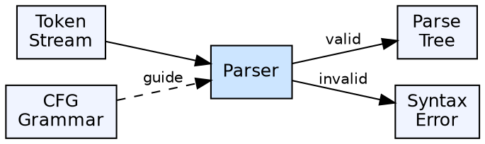

## The Problem

The token stream from lexical analysis is flat — it has no structure information. The compiler needs to reconstruct the hierarchical structure of the program (which statements are inside which blocks, how expressions are grouped) to enable semantic analysis and code generation.

## Core Idea

A parser is the component of a compiler that performs syntax analysis. It reads the token stream, checks it against the language's grammar, and produces a **parse tree** or syntax tree that represents the grammatical structure. Parsers are broadly classified as **top-down** or **bottom-up**, each with different capabilities and trade-offs.

## How It Works

The parser implements a parsing algorithm using a context-free grammar as its specification. It reads tokens left-to-right and builds a parse tree. For each token, it decides which grammar production to apply. Top-down parsers predict productions based on lookahead; bottom-up parsers shift tokens onto a stack and reduce when a production's right-hand side is recognized.

## Visual Explanation

## Key Properties

- **Input:** Token stream from the lexer
- **Output:** Parse tree (or error)
- **Two main types:** Top-down (LL) and bottom-up (LR)
- **Grammar-driven:** The parser follows the productions of a CFG
- **Error handling:** Parser errors are syntax errors — the first and most common type programmers encounter

## Connections

- **Built from:** [[lexical-analysis|Lexical Analysis]] — consumes the token stream
- **Built from:** [[context-free-grammar|Context-Free Grammar]] — uses the CFG for structural decisions
- **Builds into:** [[top-down-parsing|Top-Down Parsing]] — subclass of parsing starting from the start symbol
- **Builds into:** [[bottom-up-parsing|Bottom-Up Parsing]] — subclass of parsing starting from the input
- **Builds into:** [[semantic-analysis|Semantic Analysis]] — passes the parse tree for semantic checks
- **Related:** [[shift-reduce-parser|Shift Reduce Parser]] — the most common bottom-up parsing technique

## Edge Cases & Gotchas

- **Lookahead:** More lookahead gives more power (LL(1) vs LL(k)) but increases table size
- **Grammar class determines parser:** LR grammars are more powerful than LL grammars — LR parsers can handle more language constructs
- **Left recursion:** Top-down parsers cannot handle left recursion without entering infinite loops