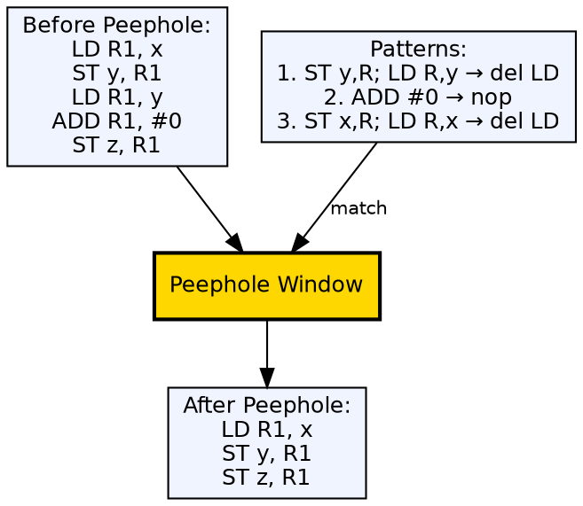
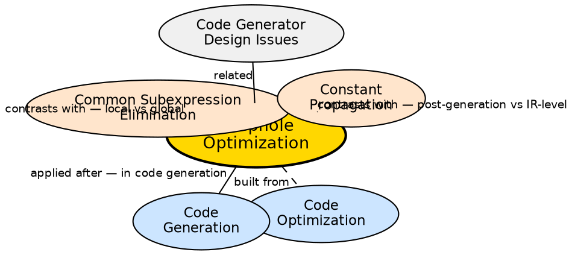

## The Problem

Code generation produces naive, literal translations of IR instructions. These often contain redundant loads/stores, dead stores, and inefficient instruction sequences that a broader global optimizer missed or that only appear after register allocation. A simple, fast post-processing pass can clean up these local inefficiencies.

## Core Idea

Peephole optimization is a simple machine-dependent optimization technique that examines a small sliding window (the "peephole") of consecutive target instructions and replaces inefficient patterns with better ones. Common patterns include: redundant load/store elimination, constant folding, strength reduction, dead code elimination, and algebraic simplifications like `x = x + 0 → nop`.

## How It Works

The peephole optimizer scans the instruction stream with a fixed-size window (typically 2-5 instructions). For each window position, it checks against a set of pattern templates. When a pattern matches, it replaces the matched instructions with the optimized replacement. The window is then repositioned to check for cascading opportunities. Common patterns: `ST R1, M; LD M, R1` → `ST R1, M` (remove redundant load), `ADD #0` → `nop` (remove no-op addition), `MUL #2` → `ADD same` (strength reduction).

## Visual Explanation

## Semantic Network

## Key Properties

- **Local scope:** Examines only a small window of instructions (typically 2-5)
- **Pattern-based:** Defined by before/after template pairs
- **Machine-dependent:** Patterns are specific to the target instruction set
- **Post-generation:** Applied after code generation or during the final phase
- **Redundant instruction elimination:** The most common peephole improvement

## Connections

- **Built from:** [[code-optimization|Code Optimization]] — peephole is a type of machine-dependent optimization
- **Built from:** [[code-generation|Code Generation]] — peephole optimizes the generated target code
- **Contrasts with:** [[common-subexpression-elimination|Common Subexpression Elimination]] — CSE is global/IR-level; peephole is local/target-level
- **Contrasts with:** [[constant-propagation|Constant Propagation]] — CP works on IR; peephole works on target instructions
- **Related:** [[code-generator-design-issues|Issues in Code Generator Design]] — instruction selection affects peephole opportunities

## Edge Cases & Gotchas

- **Cascading effect:** One peephole optimization can create an opportunity for another — the optimizer must iterate until no more patterns match
- **Oversized window:** A larger window catches more patterns but costs more to match — most implementations keep it small
- **Architecture-specific:** A peephole optimization on x86 may not apply to ARM — patterns must be defined per target
- **Safety:** Must preserve program semantics — pattern matching must be conservative about flags and condition codes