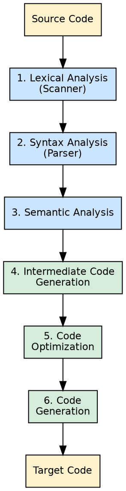

## The Problem

Translation from high-level source to low-level target code is too complex for a single monolithic step. Without a phased approach, error handling, optimization, and code generation would be entangled, making compilers impossible to build, maintain, or reason about.

## Core Idea

The compilation process is divided into a sequence of phases, each performing a specific transformation. The six standard phases are: lexical analysis, syntax analysis, semantic analysis, intermediate code generation, code optimization, and code generation. These phases are grouped into the front-end (analysis) and back-end (synthesis).

## How It Works

The source program passes through each phase sequentially. The output of one phase becomes the input to the next. **Lexical analysis** produces tokens. **Syntax analysis** produces a parse tree. **Semantic analysis** checks type consistency and augments the syntax tree. **Intermediate code generation** produces a machine-independent IR. **Code optimization** improves the IR. **Code generation** produces the target machine code.

## Visual Explanation

## Key Properties

- **Phases are independent:** Each phase has a well-defined input and output
- **Front-end:** Phases 1-3 (source-language dependent)
- **Back-end:** Phases 4-6 (target-machine dependent)
- **Symbol table:** All phases interact with a shared symbol table
- **Error handling:** Each phase can detect and report errors

## Connections

- **Built from:** [[lexical-analysis|Lexical Analysis]] — phase 1, scans source code into tokens
- **Built from:** [[syntax-analysis|Syntax Analysis]] — phase 2, builds parse tree from tokens
- **Built from:** [[semantic-analysis|Semantic Analysis]] — phase 3, enforces type rules and scoping
- **Builds into:** [[compiler-pass|Compiler Pass]] — phases can be grouped into passes (single or multi-pass)
- **Related:** [[intermediate-code-generation|Intermediate Code Generation]] — phase 4, generates machine-independent IR
- **Related:** [[code-optimization|Code Optimization]] — phase 5, improves IR quality
- **Related:** [[code-generation|Code Generation]] — phase 6, produces target code

## Edge Cases & Gotchas

- **Phases vs Passes:** A single pass can combine multiple phases (e.g., lexical and syntax analysis often interleave)
- **Phase ordering:** Code optimization can span multiple passes or even be optional for simple compilers
- **Symbol table access:** All phases read/write the symbol table — it is not a phase but a supporting data structure used throughout