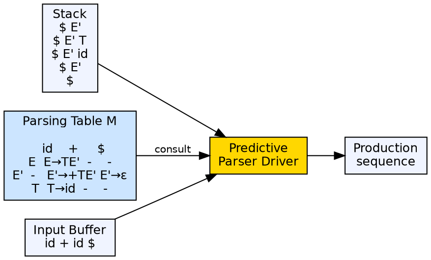
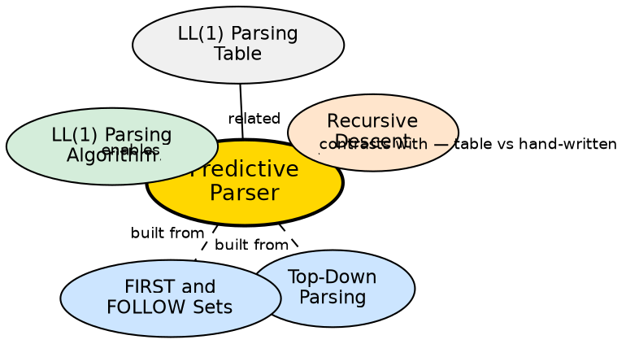

## The Problem

Recursive descent parsers require writing code for each non-terminal. For large grammars, this becomes labor-intensive. The parsing logic — choosing which production to apply based on lookahead — can be mechanized: given a grammar, a parsing table can be constructed automatically, and a generic driver can use the table to parse any LL(1) grammar.

## Core Idea

A predictive parser is a table-driven top-down parser that uses a **parsing table** (rows = non-terminals, columns = terminals) to decide which production to apply. It maintains an explicit stack of grammar symbols, eliminating the need for recursive function calls. The parser is driven by a simple algorithm: look up the top-of-stack non-terminal and current input token in the table to determine the next action.

## How It Works

The predictive parser has an input buffer, a stack (initialized with `$` and the start symbol), and a parsing table `M[A, a]`. At each step, it examines `X` (top of stack) and `a` (current input token). If `X` is a terminal matching `a`, it pops and advances. If `X` is a non-terminal, it looks up `M[X, a]` and replaces `X` with the production's right-hand side (pushed in reverse order). If the table entry is empty, a syntax error is reported.

## Visual Explanation

## Semantic Network

## Key Properties

- **Table-driven:** A single algorithm works for any LL(1) grammar by swapping the parsing table
- **Non-recursive:** Uses an explicit stack instead of function call recursion
- **LL(1):** Requires exactly one token of lookahead for deterministic decisions
- **Grammar requirements:** No left recursion, no common prefixes (must be left-factored)
- **Efficient:** Linear time O(n) where n is input length

## Connections

- **Built from:** [[top-down-parsing|Top-Down Parsing]] — predictive parsing is a specific top-down approach
- **Built from:** [[first-and-follow-sets|FIRST and FOLLOW Sets]] — used to construct the parsing table
- **Builds into:** [[ll1-parsing-algorithm|LL(1) Parsing Algorithm]] — the algorithm that drives the table
- **Contrasts with:** [[recursive-descent-parser|Recursive Descent Parser]] — table-driven vs hand-written approach
- **Related:** [[ll1-parsing-table|LL(1) Parsing Table]] — the data structure that the algorithm uses

## Edge Cases & Gotchas

- **Multiple entries:** If the table has multiple entries for the same cell, the grammar is not LL(1)
- **ε-productions:** Handled by using FOLLOW sets — when a non-terminal can derive ε, the parser matches its FOLLOW set
- **Error detection:** Errors are detected when the table entry is empty — error recovery routines can use the stack to skip tokens
- **LL(1) limitation:** Not all grammars are LL(1) — operator precedence and certain if-then-else constructs require more lookahead