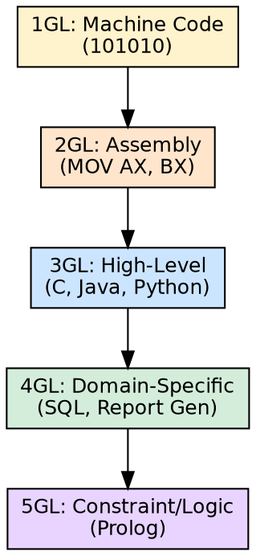

## The Problem

Programming languages evolved from machine-specific binary to human-readable abstractions. Understanding this evolution reveals why compilers exist, what problems different translation strategies solve, and how language design shapes compiler architecture.

## Core Idea

Programming languages are classified into five generations based on their level of abstraction from machine code. **1GL** is machine code (binary). **2GL** is assembly language (mnemonics for machine instructions). **3GL** is high-level languages (C, C++, Java, Python) — compiled or interpreted. **4GL** is domain-specific languages (SQL, report generators). **5GL** is constraint/logic-based languages (Prolog).

## How It Works

Each generation raises the level of abstraction, making code more human-readable and portable but requiring more complex translation. 1GL needs no translation (runs directly). 2GL needs an assembler. 3GL needs a compiler or interpreter. 4GL and 5GL often use both compilation and interpretation, sometimes with just-in-time compilation for performance.

## Visual Explanation

## Key Properties

- **1GL:** Binary machine code, platform-specific, no translation needed
- **2GL:** Assembly language, one-to-one with machine instructions, needs assembler
- **3GL:** High-level, portable, needs compiler or interpreter
- **4GL:** Domain-specific, declarative, often uses sophisticated interpreters
- **5GL:** Constraint/logic based, specify what not how

## Connections

- **Related:** [[compiler|Compiler]] — compilers translate 3GL and above to lower-level code
- **Related:** [[compiler-vs-interpreter|Compiler vs Interpreter]] — 3GL+ languages use either or both translation strategies
- **Related:** [[phases-of-compiler|Phases of a Compiler]] — the abstraction gap between generations determines compiler complexity
- **Related:** [[programming-language-generations|Programming Language Generations]] — the evolution that made compilers necessary

## Edge Cases & Gotchas

- **Classification is rough:** Some languages span generations (Python is 3GL with some 4GL characteristics)
- **JIT blurs the line:** Java is compiled to bytecode (3GL→intermediate) then JIT-compiled to native at runtime
- **Modern trend:** Most new languages compile to an intermediate representation (bytecode, WASM) rather than directly to machine code