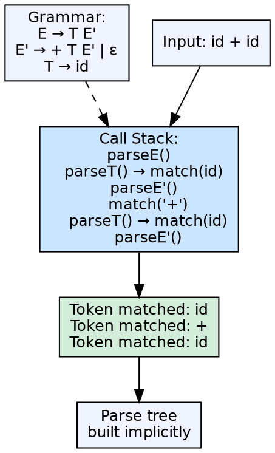
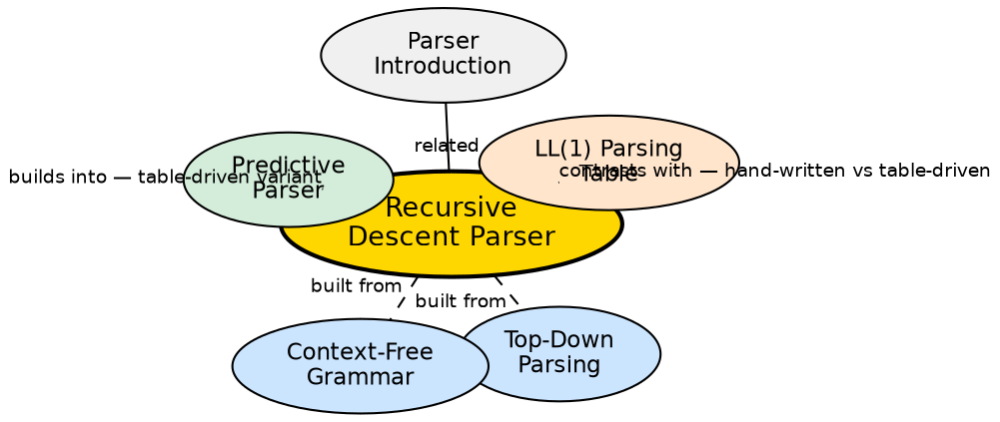

## The Problem

Parser generators (Yacc, Bison) are powerful but introduce a build-time dependency and generate code that can be hard to debug. For many languages — especially simple ones, domain-specific languages, or educational compilers — a hand-written parser is simpler to maintain, debug, and integrate with the rest of the compiler.

## Core Idea

A recursive descent parser is a top-down parser where each non-terminal in the grammar becomes a function in the implementation language. These functions call each other recursively, consuming tokens from the input as they match productions. The parser's call stack mirrors the parse tree structure, and each function is responsible for recognizing one grammar construct.

## How It Works

For each non-terminal `A`, a function `parseA()` is written. The function examines the current token (lookahead) and uses it to decide which production of `A` to apply. It then calls the functions for the non-terminals in the chosen production's right-hand side and consumes the expected terminals. For alternatives (`A → α | β`), the parser uses lookahead to choose the correct branch. Backtracking is possible but rarely used in practice — predictive recursive descent avoids it entirely.

## Visual Explanation

## Semantic Network

## Key Properties

- **One function per non-terminal:** The grammar structure directly maps to code structure
- **Lookahead-based choice:** The function uses the current token to choose which production to apply
- **No backtracking (predictive):** Efficient recursive descent avoids backtracking by using sufficient lookahead
- **Call stack = parse tree:** The recursion depth matches the nesting depth of the input
- **Common in production compilers:** GCC, Clang, and many production compilers use hand-written recursive descent parsers

## Connections

- **Built from:** [[top-down-parsing|Top-Down Parsing]] — recursive descent is the most concrete implementation of top-down parsing
- **Built from:** [[context-free-grammar|Context-Free Grammar]] — the grammar is coded as mutually recursive functions
- **Contrasts with:** [[predictive-parser|Predictive Parser]] — recursive descent is hand-written; predictive uses a parsing table
- **Related:** [[parser-introduction|Parser Introduction]] — recursive descent is a type of top-down parser
- **Related:** [[first-and-follow-sets|FIRST and FOLLOW Sets]] — used to guide lookahead decisions in the hand-written functions

## Edge Cases & Gotchas

- **Left recursion:** Recursive descent parsers loop infinitely on left-recursive grammars — must eliminate left recursion first
- **Backtracking overhead:** Naive backtracking recursive descent can have exponential worst-case time
- **Error reporting:** Hand-written parsers can produce better error messages than generated parsers, but require careful coding
- **Grammar changes:** Changing the grammar requires rewriting the corresponding functions — parser generators handle this automatically

## Sources

- [[cd2-summary|Compiler Design for GATE Exam]] — covers recursive descent parser as a type of top-down parser
