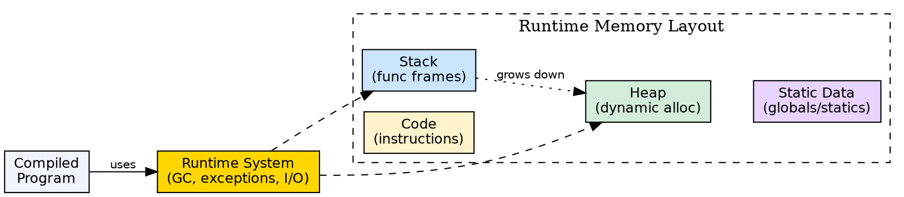

## The Problem

Compiled code must execute in a structured environment that manages memory, handles function calls, and supports the language's features. Without a runtime environment, the compiled binary would have no mechanism for dynamic memory allocation, function call/return, or exception handling.

## Core Idea

The runtime environment is the execution context in which the compiled program runs. It includes the **call stack** (active function calls), **heap** (dynamic memory), **activation records** (function state), and the **runtime system** (library code for language features like garbage collection, exception handling, and I/O).

## How It Works

When a function is called, the runtime pushes an **activation record** (stack frame) onto the call stack. This record contains the return address, local variables, parameters, and saved registers. When the function returns, the record is popped. The heap grows dynamically as memory is allocated. The runtime system provides services that the compiled code calls — memory allocators, exception handlers, type-checking code.

## Visual Explanation

## Key Properties

- **Call stack:** Manages function activation records in LIFO order
- **Heap:** Dynamic memory for objects that outlive the creating function
- **Activation record:** Stores return address, parameters, local variables, temporaries
- **Static data:** Global variables and static local variables allocated at load time
- **Runtime system:** Library of services (memory management, I/O, error handling)

## Connections

- **Built from:** [[storage-allocation-strategies|Storage Allocation Strategies]] — runtime uses stack, heap, and static allocation
- **Built from:** [[linker-and-loader|Linker and Loader]] — the loader sets up the initial runtime environment
- **Related:** [[static-and-dynamic-scoping|Static and Dynamic Scoping]] — scoping rules affect how runtime resolves variable references
- **Related:** [[code-generation|Code Generation]] — generated code must follow runtime calling conventions
- **Related:** [[compiler|Compiler]] — the runtime environment is where compiled programs execute

## Edge Cases & Gotchas

- **Stack overflow:** Infinite recursion or very deep call chains exhaust the stack
- **Garbage collection:** Managed languages (Java, C#) include GC in the runtime — the compiler must generate GC-friendly code
- **Setjmp/Longjmp:** Non-local jumps bypass normal stack frame unwinding — compilers must handle this carefully
- **Trampolines and thunks:** Dynamic dispatch (virtual functions) requires runtime support from the environment

## Sources

- [[compilerdesign-summary|Compiler Design Tutorial]] — covers runtime environments as a compiler topic
- [[cd2-summary|Compiler Design for GATE Exam]] — covers runtime environment and activation records
