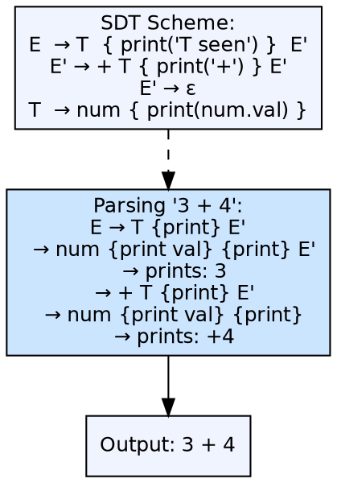
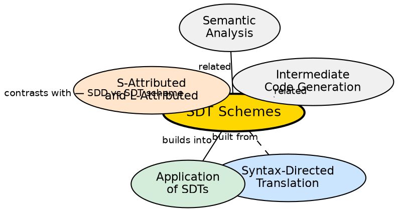

## The Problem

Syntax-directed definitions specify semantic rules as equations attached to productions, but they don't prescribe when during parsing the rules execute. For side-effecting actions (like emitting code or printing), the compiler needs an execution order. A translation scheme embeds actions at specific positions within productions to control when they fire.

## Core Idea

A syntax-directed translation scheme (SDT scheme) is a context-free grammar with semantic actions embedded at specific positions in the right-hand side of productions. Unlike SDDs (which declaratively specify attributes), SDT schemes prescribe an **evaluation order** — actions execute when the parser reaches their position during parsing. Actions can be placed before, between, or after the grammar symbols.

## How It Works

In an SDT scheme, actions are enclosed in braces `{ }` and placed within the production right-hand side. During top-down parsing, actions execute in left-to-right order as the parser expands non-terminals. During bottom-up parsing, actions placed at the end execute at reduce time; actions in the middle require splitting the production (creating a marker non-terminal) to ensure proper execution order.

## Visual Explanation

## Semantic Network

## Key Properties

- **Actions embedded in productions:** Semantic actions are placed within the RHS, not just at the end
- **Execution order prescribed:** Actions fire when the parser reaches their position
- **Top-down execution:** Left-to-right, in order of recursive descent expansion
- **Bottom-up execution:** End-of-production actions at reduce time; middle actions need marker productions
- **Infix notation translation:** SDT schemes naturally produce prefix, postfix, or infix output

## Connections

- **Built from:** [[syntax-directed-translation|Syntax-Directed Translation]] — SDT schemes are the operational form of SDDs
- **Builds into:** [[application-of-sdts|Application of SDTs]] — SDT schemes are used for practical translation tasks
- **Related:** [[attributed-sdt|S-Attributed and L-Attributed SDTs]] — classification of attributes in SDDs vs action placement in schemes
- **Related:** [[intermediate-code-generation|Intermediate Code Generation]] — SDT schemes often emit intermediate code as actions
- **Related:** [[semantic-analysis|Semantic Analysis]] — SDT schemes execute semantic checks during parsing

## Edge Cases & Gotchas

- **Bottom-up middle actions:** Actions in the middle of a production must be hoisted by creating a marker non-terminal — increases grammar size
- **Side effect ordering:** When multiple actions have side effects, the order must be carefully designed
- **Action dependencies:** An action may reference values from symbols before and after it — placement matters
- **LL vs LR compatibility:** SDT schemes are natural for LL parsing (left-to-right execution) but require care with bottom-up parsers