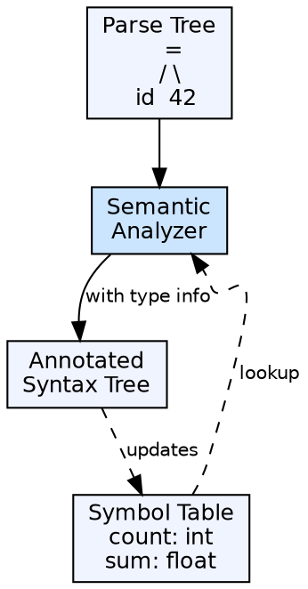

## The Problem

A program can be syntactically correct but semantically meaningless or unsafe. For example, adding a string to an integer or using an undeclared variable passes syntax analysis but makes no sense. The compiler needs to catch these logical and type errors.

## Core Idea

Semantic analysis is the third phase of a compiler. It checks the source program for semantic consistency — type compatibility, variable declaration before use, function call argument matching, and scope rules. It augments the syntax tree with type information and performs type checking.

## How It Works

The semantic analyzer traverses the syntax tree (or parse tree) and verifies semantic rules. It checks that every identifier is declared, that types are compatible in expressions and assignments, that function calls match their signatures, and that control flow constructs are well-formed. It uses the **symbol table** extensively to resolve identifiers and their attributes.

## Visual Explanation

## Key Properties

- **Input:** Parse tree / syntax tree
- **Output:** Annotated syntax tree with type information
- **Type checking:** Ensures operands have compatible types
- **Scope resolution:** Maps identifier usages to their declarations
- **L-value/R-value checking:** Ensures the left side of assignment is an l-value

## Connections

- **Built from:** [[syntax-analysis|Syntax Analysis]] — consumes the parse tree
- **Built from:** [[wiki/compilerdesign/symbol-table-in-compiler|Symbol Table]] — uses symbol table for identifier resolution and type info
- **Builds into:** [[intermediate-code-generation|Intermediate Code Generation]] — the annotated tree feeds IR generation
- **Related:** [[static-and-dynamic-scoping|Static and Dynamic Scoping]] — scoping rules are enforced during semantic analysis
- **Related:** [[phases-of-compiler|Phases of a Compiler]] — semantic analysis is phase 3

## Edge Cases & Gotchas

- **Type coercion:** Languages like C automatically convert int to float — the analyzer must insert implicit type conversion nodes
- **Duck typing:** Dynamically typed languages defer type checking to runtime — semantic analysis in their compilers is lighter
- **Function overloading:** The semantic analyzer must resolve which overloaded function is being called based on argument types

## Sources

- [[compilerdesign-summary|Compiler Design Tutorial]] — covers semantic analysis as the third compiler phase
