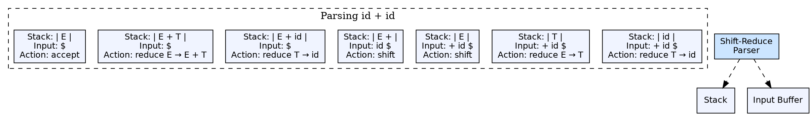

## The Problem

Building a parse tree bottom-up requires an algorithm to decide when a group of tokens forms a complete grammatical unit (a handle) and should be replaced by a non-terminal. The parser needs a systematic way to stack input and identify production right-hand sides.

## Core Idea

A shift-reduce parser is the basic framework for bottom-up parsing. It uses a stack to hold grammar symbols and an input buffer. The parser repeatedly **shifts** input tokens onto the stack until it recognizes a **handle** (a production right-hand side) at the top of the stack, then **reduces** by popping the handle and pushing the corresponding non-terminal.

## How It Works

The parser has four possible actions: **shift** (push next input token onto stack), **reduce** (pop handle, push non-terminal), **accept** (parsing successful), or **error** (syntax error). The parser continues shifting and reducing until it reduces the entire input to the start symbol. Conflicts arise when the parser can both shift and reduce (shift/reduce conflict) or reduce by two different productions (reduce/reduce conflict).

## Visual Explanation

## Key Properties

- **Stack-based:** Grammar symbols are pushed/popped from a stack
- **Four actions:** Shift, Reduce, Accept, Error
- **Handle identification:** The parser must identify handles correctly
- **Conflicts:** Shift/reduce and reduce/reduce conflicts require resolution rules
- **Foundation:** LR parsers (SLR, CLR, LALR) are shift-reduce parsers with decision tables

## Connections

- **Built from:** [[bottom-up-parsing|Bottom-Up Parsing]] — shift-reduce is the mechanism for bottom-up parsing
- **Builds into:** [[lr-parsers|LR Parsers]] — SLR, CLR, and LALR extend shift-reduce with state-based decision tables
- **Related:** [[operator-precedence-parser|Operator Precedence Parser]] — a simpler shift-reduce variant using operator precedence relations
- **Related:** [[syntax-analysis|Syntax Analysis]] — shift-reduce is a key parsing approach
- **Related:** [[wiki/compilerdesign/ambiguous-grammar|Ambiguous Grammar]] — ambiguity causes shift/reduce and reduce/reduce conflicts

## Edge Cases & Gotchas

- **Handle identification:** The handle is always at the top of the stack — never buried — in viable prefix parsing
- **Conflict resolution in Yacc:** Yacc resolves shift/reduce conflicts in favor of shift, reduce/reduce in favor of the first production listed
- **Default reductions:** In ambiguous situations, the parser may make a default choice that doesn't match the language designer's intent

## Sources

- [[compilerdesign-summary|Compiler Design Tutorial]] — covers shift-reduce parser as a type of bottom-up parser
- [[cd2-summary|Compiler Design for GATE Exam]] — covers shift-reduce parsing as a bottom-up parsing technique
