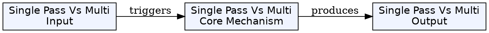
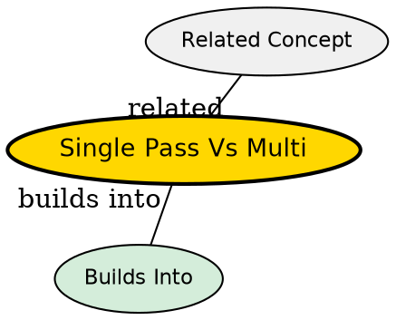

## What's Being Compared

A fundamental compiler design decision: how many complete scans (passes) over the source code should the compiler make? Single-pass compilers trade code quality for speed and simplicity; multi-pass compilers trade compilation time for optimization and flexibility.

## The Core Tension

Single-pass compilers must generate code on the fly, which means they cannot perform global optimizations or handle forward references without restrictions. Multi-pass compilers can analyze the entire program before generating code, enabling sophisticated optimization, but require more memory and compile time.

## Comparison

| Dimension | [[compiler-pass|Single-Pass Compiler]] | [[compiler-pass|Multi-Pass Compiler]] |
|-----------|--------------|--------------|
| Architecture | One scan, phases interleaved | Multiple scans, separate phases |
| Compilation speed | Fast | Slower (more I/O) |
| Code quality | Lower (local decisions) | Higher (global analysis) |
| Memory usage | Lower (no IR storage) | Higher (IR between passes) |
| Language constraints | No forward refs without restriction | Forward refs handled naturally |
| Optimization | Minimal | Full suite possible |
| Error recovery | Limited | Better (more context) |
| Classic example | Pascal | C, C++ |

## When to Choose Single-Pass

- Language designed for single-pass (Pascal)
- Simple, restricted language constructs
- Memory-constrained environments (embedded systems)
- Rapid prototyping compilers

## When to Choose Multi-Pass

- Complex language with forward references (C/C++)
- Optimization is important (production compilers)
- Multiple target architectures (same front-end, different back-ends)
- Modular compiler development (separate teams can work on different passes)

## The Insight

The single-pass vs multi-pass distinction is not binary -- modern compilers like LLVM use a multi-pass architecture but keep all IR in memory rather than writing intermediate files, getting the best of both worlds: fast inter-pass communication and powerful optimization.

## Visual Explanation

## Semantic Network

## Connections

- [[compiler-pass|Compiler Pass]] -- the core concept being compared
- [[phases-of-compiler|Phases of a Compiler]] -- how phases are grouped into passes
- [[code-optimization|Code Optimization]] -- multi-pass enables sophisticated optimization
- [[compiler|Compiler]] -- the overall compiler architecture
- [[object-code|Object Code]] -- how passes affect final code quality