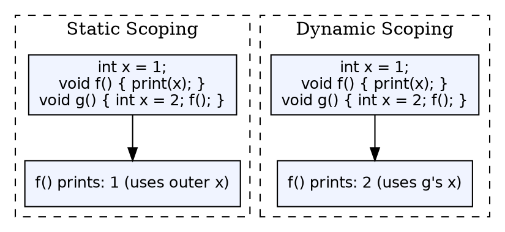

## The Problem

When a variable name is used in a program, the compiler needs to determine which declaration it refers to. Different scoping rules yield different bindings for the same code, potentially changing program behavior. The compiler must implement the correct scoping strategy.

## Core Idea

**Static (lexical) scoping** resolves variable references based on the program's textual structure at compile time — an inner scope sees bindings from enclosing scopes. **Dynamic scoping** resolves references based on the call stack at runtime — a function sees variables from the function that called it. Most compiled languages (C, Java) use static scoping; some scripting languages (older Lisp, bash) use dynamic scoping.

## How It Works

In static scoping, the compiler determines the binding of each variable by examining the nesting structure of the program. A variable in an inner scope refers to the nearest declaration in an enclosing scope. In dynamic scoping, the binding is determined at runtime by walking the call stack — a variable refers to the most recent declaration in the current call chain.

## Visual Explanation

## Key Properties

- **Static scoping:** Binding determined at compile time, based on program text
- **Dynamic scoping:** Binding determined at runtime, based on call stack
- **Static advantage:** Type checking at compile time, faster variable access, more reliable
- **Dynamic advantage:** More flexible, easier to implement (interpreter-friendly)
- **Scope chains:** Static scoping uses lexical nesting (block structure); dynamic scoping uses stack frames

## Connections

- **Built from:** [[semantic-analysis|Semantic Analysis]] — scoping rules are enforced during semantic analysis
- **Built from:** [[wiki/compilerdesign/symbol-table-in-compiler|Symbol Table]] — symbol table lookup implements scope resolution
- **Related:** [[runtime-environment|Runtime Environment]] — dynamic scoping requires runtime support for scope chain traversal
- **Related:** [[phases-of-compiler|Phases of a Compiler]] — scope is determined during analysis phase
- **Related:** [[storage-allocation-strategies|Storage Allocation Strategies]] — scoping determines when variables are allocated/deallocated

## Edge Cases & Gotchas

- **Static scoping with dynamic features:** Closures and first-class functions mix static scoping with runtime binding — variables captured in a closure are determined statically
- **Dynamic scoping issues:** Makes programs harder to reason about — a function's behavior depends on who calls it
- **Scope holes:** In some languages, a variable declared in a scope shadows outer declarations — the outer variable becomes inaccessible in the inner scope