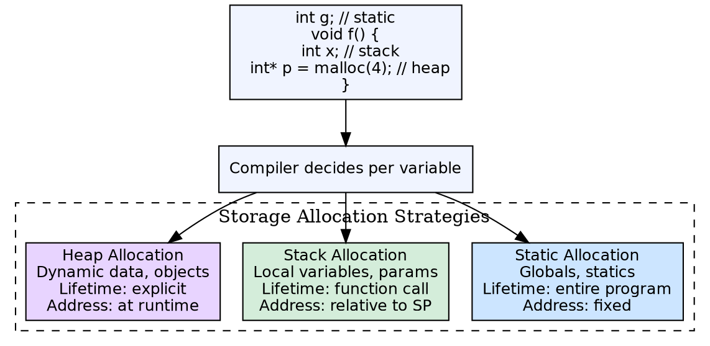

## The Problem

A compiled program needs memory to store variables, data structures, and intermediate values. Different kinds of data have different lifetimes — global variables live for the entire program, local variables live only during a function call, and dynamically allocated data can outlive the creating function.

## Core Idea

Three storage allocation strategies match data lifetimes: **static allocation** (compile-time fixed addresses, entire program lifetime), **stack allocation** (LIFO, function-local data), and **heap allocation** (dynamic, programmer-controlled lifetime). The compiler decides which strategy to use based on the data's scope and lifetime.

## How It Works

**Static allocation:** Globals and static variables get fixed addresses determined at compile time, stored in the data segment. **Stack allocation:** Local variables and parameters are allocated on the call stack within activation records — they are automatically deallocated when the function returns. **Heap allocation:** Memory is explicitly allocated (malloc/new) and freed (free/delete) by the program, managed by the runtime's memory allocator.

## Visual Explanation

## Key Properties

- **Static:** Fixed address, fast access, no overhead, entire program lifetime
- **Stack:** LIFO, automatic allocation/deallocation, function-scoped
- **Heap:** Flexible, dynamic sizes, explicit management, risk of leaks/fragmentation
- **Compiler must decide:** For each variable, the compiler selects the appropriate strategy
- **Recursive functions:** Require stack allocation (or heap) — static allocation cannot support recursion

## Connections

- **Built from:** [[runtime-environment|Runtime Environment]] — storage allocation is a key function of the runtime
- **Built from:** [[static-and-dynamic-scoping|Static and Dynamic Scoping]] — scoping determines variable lifetimes, which guides allocation strategy
- **Related:** [[code-generation|Code Generation]] — the code generator emits instructions for each allocation type
- **Related:** [[symbol-table-in-compiler|Symbol Table]] — the symbol table stores the storage class and allocation information
- **Related:** [[linker-and-loader|Linker and Loader]] — loader sets up static data and stack pointer

## Edge Cases & Gotchas

- **Dangling pointers:** Heap-allocated memory freed while still referenced — the compiler can't always detect this
- **Memory leaks:** Heap memory not freed — managed languages use GC to prevent this
- **Recursion requires stack:** Without dynamic allocation (stack or heap), recursive functions cannot work because each call needs separate local variables
- **Fragmentation:** Heap allocation can fragment memory, causing allocation failures even when enough total free memory exists

## Sources

- [[compilerdesign-summary|Compiler Design Tutorial]] — covers storage allocation strategies in runtime environments
