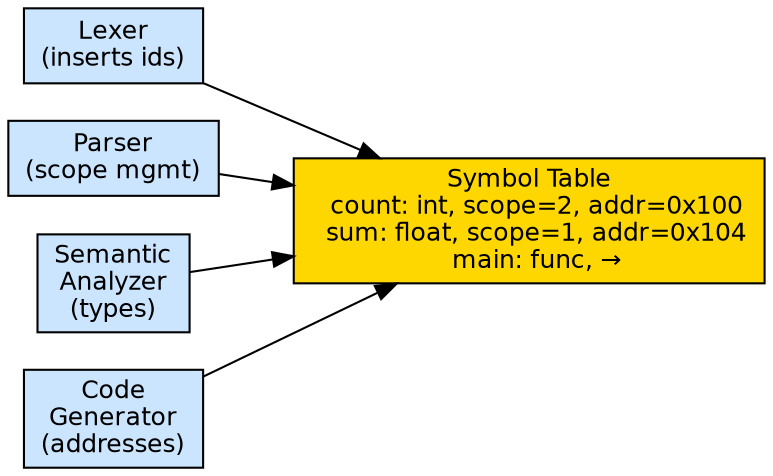

## The Problem

A compiler needs to store and retrieve information about identifiers (variables, functions, types) as it processes the source program. Without a symbol table, the compiler would have no way to enforce scope rules, check type consistency, or generate correct memory references.

## Core Idea

A symbol table is a data structure maintained by the compiler that stores information about each identifier in the source program: its name, type, scope, memory location, and other attributes. All phases of the compiler interact with the symbol table — the lexer inserts new identifiers, the semantic analyzer looks up types, and the code generator retrieves memory addresses.

## How It Works

When the lexer encounters an identifier, it checks the symbol table. If the identifier is new (first occurrence), it's inserted with tentative attributes. During semantic analysis, the table is updated with type information, scope information, and memory offsets. The code generator reads the table to determine variable addresses. The table is typically implemented as a hash table for O(1) lookup.

## Visual Explanation

## Key Properties

- **All-phase interaction:** Every compiler phase reads from or writes to the symbol table
- **Scope management:** Symbols are organized by scope — entering a scope pushes a new layer, exiting pops it
- **Typical operations:** insert(name), lookup(name), delete(name), update(attributes)
- **Implementation:** Hash table for primary access, often with linked lists for scope chains
- **Stored information:** Name, type, scope level, size, memory offset, line number

## Connections

- **Built from:** [[lexical-analysis|Lexical Analysis]] — lexer inserts identifiers into the symbol table
- **Built from:** [[semantic-analysis|Semantic Analysis]] — checks and updates type information in the symbol table
- **Builds into:** [[code-generation|Code Generation]] — retrieves memory addresses and type info for code emission
- **Related:** [[static-and-dynamic-scoping|Static and Dynamic Scoping]] — scoping strategy determines symbol table organization
- **Related:** [[phases-of-compiler|Phases of a Compiler]] — symbol table is used across all phases

## Edge Cases & Gotchas

- **Nested scopes:** Same name can refer to different variables in different scopes — lookup must search from innermost to outermost
- **Forward references:** In languages allowing forward references (C), the symbol entry may be created before its full type is known
- **Overloaded functions:** C++/Java allow multiple functions with the same name but different parameters — the symbol table must store multiple entries with different signatures