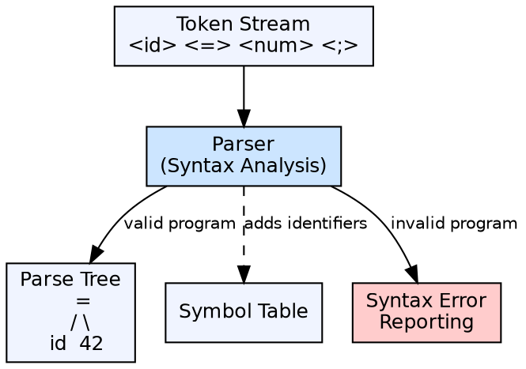

## The Problem

A token stream is still flat and lacks structure. The compiler needs to verify whether the sequence of tokens forms a valid program according to the language's grammar — checking for missing semicolons, unbalanced parentheses, incorrect statement ordering, and structural violations.

## Core Idea

Syntax analysis (parsing) is the second phase of a compiler. It takes the token stream from the lexer and determines whether it conforms to the grammar rules of the programming language. The output is typically a **parse tree** (or syntax tree) that represents the grammatical structure of the program.

## How It Works

The parser reads tokens and applies grammar rules to build a derivation of the program. It uses a **context-free grammar (CFG)** as its specification. Two major parsing strategies exist: **top-down** (builds the tree from the start symbol, expanding non-terminals) and **bottom-up** (builds the tree from the tokens, reducing to the start symbol).

## Visual Explanation

## Key Properties

- **Input:** Token stream from lexical analysis
- **Output:** Parse tree / syntax tree (or error)
- **Grammar-based:** Uses a context-free grammar to define valid syntax
- **Error recovery:** Can report errors and continue parsing to find more errors
- **Two strategies:** Top-down (recursive descent, LL) vs bottom-up (LR, LALR)

## Connections

- **Built from:** [[lexical-analysis|Lexical Analysis]] — consumes the token stream produced by the lexer
- **Built from:** [[context-free-grammar|Context-Free Grammar]] — the grammar is the specification the parser checks against
- **Builds into:** [[semantic-analysis|Semantic Analysis]] — the parse tree is input for semantic checks
- **Related:** [[top-down-parsing|Top-Down Parsing]] — builds parse tree from root to leaves
- **Related:** [[bottom-up-parsing|Bottom-Up Parsing]] — builds parse tree from leaves to root
- **Related:** [[ambiguous-grammar|Ambiguous Grammar]] — a grammar that allows multiple parse trees for the same input

## Edge Cases & Gotchas

- **Left recursion:** Top-down parsers cannot handle left-recursive grammars — must be eliminated
- **Ambiguity:** An ambiguous grammar can produce two different parse trees for the same program
- **Error recovery strategies:** Panic mode (skip tokens until sync token found), phrase-level recovery, error productions

## Sources

- [[compilerdesign-summary|Compiler Design Tutorial]] — covers syntax analysis as the second compiler phase
- [[cd2-summary|Compiler Design for GATE Exam]] — covers syntax analysis, CFG classification, and parsing
