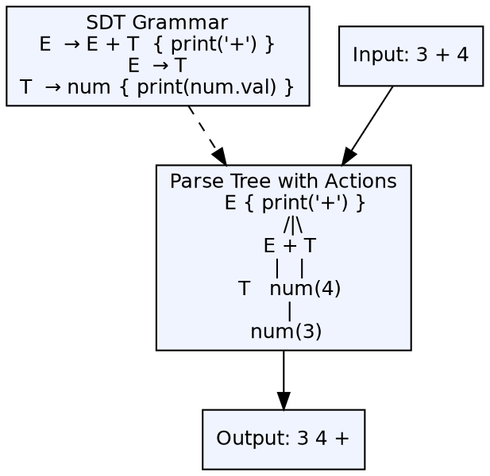

## The Problem

The grammar defines what programs look like (syntax), but the compiler also needs to specify what programs mean and how they translate. Without integrating semantics into the grammar, the compiler would need a separate, disconnected mechanism to associate semantic actions with syntactic constructs.

## Core Idea

Syntax-directed translation (SDT) attaches semantic rules or actions to grammar productions. Each production A → α has an associated semantic action that is executed when that production is used in a derivation. SDTs allow the compiler to perform type checking, code generation, and other semantic processing during parsing.

## How It Works

An SDT annotates grammar productions with semantic actions enclosed in braces. For example, `E → E + T { print('+'); }`. The actions are executed at the specified position in the production during parsing. In bottom-up parsing, actions associated with the end of a production execute at reduce time. In top-down parsing, actions execute when the corresponding position is reached.

## Visual Explanation

## Key Properties

- **Grammar + Actions:** Productions have embedded semantic actions
- **Execution timing:** During parsing (not after) — integrated into the parsing process
- **Two forms:** Syntax-directed definitions (attributes) and translation schemes (actions)
- **Action positions:** Actions can be placed anywhere in the production right-hand side
- **Output:** Semantic evaluation produces the translation (code, types, etc.)

## Connections

- **Built from:** [[context-free-grammar|Context-Free Grammar]] — SDTs extend CFGs with semantic actions
- **Builds into:** [[attributed-sdt|S-Attributed and L-Attributed SDTs]] — classification of SDTs by attribute flow direction
- **Related:** [[syntax-analysis|Syntax Analysis]] — SDT actions execute during syntax analysis
- **Related:** [[intermediate-code-generation|Intermediate Code Generation]] — SDTs often emit intermediate code as their actions
- **Related:** [[semantic-analysis|Semantic Analysis]] — SDTs can perform type checking during parsing

## Edge Cases & Gotchas

- **Action ordering:** In bottom-up parsing, actions at the end of the production execute at reduce time — actions in the middle need special handling (split productions)
- **Inherited attributes:** When attributes flow down the parse tree, the order of execution must be carefully managed
- **Side effects:** Actions can have side effects (printing, emitting code) — these must be ordered correctly to produce the right output