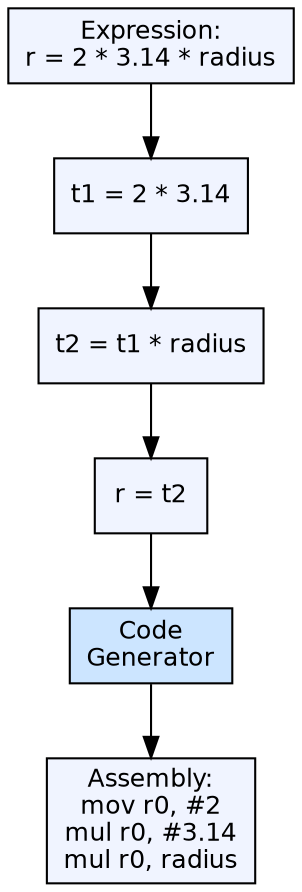

## The Problem

High-level language constructs (complex expressions, nested loops, function calls) are far removed from machine instructions. Translating directly from AST to machine code is complex and obscures optimization opportunities. A simpler, lower-level intermediate representation makes both translation and optimization easier.

## Core Idea

Three-address code (TAC) is an intermediate representation where each instruction has at most three operands — typically two source operands and one destination. Each TAC instruction performs a single operation: `a = b op c`. TAC simplifies code generation by breaking complex expressions into elementary steps and provides a flat instruction sequence that is easy to analyze and optimize.

## How It Works

The intermediate code generator translates the AST into a sequence of TAC instructions. Complex expressions become multiple TAC instructions using temporary variables. Control flow is handled with conditional and unconditional jumps. Common TAC instruction forms include: assignment (`x = y`), binary operation (`x = y + z`), unary operation (`x = -y`), copy (`x = y`), conditional jump (`if x goto L`), and function calls.

## Visual Explanation

## Key Properties

- **Three operands:** Two source, one destination (occasionally fewer)
- **Single operation per instruction:** Each TAC instruction does exactly one thing
- **Temporary variables:** Intermediate results stored in compiler-generated temporaries
- **Flat sequence:** Unlike the AST, TAC is a linear instruction sequence
- **Variants:** Quadruples (op, arg1, arg2, result), triples (indirect references), indirect triples

## Connections

- **Built from:** [[intermediate-code-generation|Intermediate Code Generation]] — TAC is a common form of intermediate code
- **Builds into:** [[code-optimization|Code Optimization]] — optimization algorithms operate on TAC
- **Builds into:** [[code-generation|Code Generation]] — code generator translates TAC to target instructions
- **Related:** [[loop-detection-in-tac|Detection of a Loop in TAC]] — analyzing loops in three-address code for optimization
- **Related:** [[data-flow-analysis|Data Flow Analysis]] — data-flow analysis works on TAC instruction sequences

## Edge Cases & Gotchas

- **Addressing modes:** TAC abstracts away target-specific addressing — the code generator handles the mapping
- **Symbolic labels:** TAC uses symbolic labels for jumps — these must be resolved to actual addresses during code generation
- **Three-address vs SSA:** Static single assignment (SSA) form extends TAC by ensuring every variable is assigned exactly once — more powerful for optimization