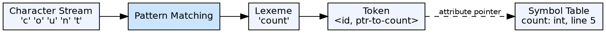

## The Problem

Raw source code is a character string, but the grammar of a programming language operates on meaningful syntactic units (keywords, identifiers, operators). Without a token abstraction, the parser would need to match individual characters, making grammar rules exponentially more complex.

## Core Idea

A token is a pair consisting of a **token class** (or token type) and an optional **attribute value**. A **lexeme** is the actual character sequence matched from the source. For example, in `count = 42`, the lexeme `count` maps to token class `<id>` with attribute value pointing to the symbol table entry for `count`.

## How It Works

The lexer groups characters into lexemes by matching patterns (regular expressions). Each lexeme is classified into a token class. Keywords have dedicated token classes (`IF`, `WHILE`). Identifiers all share the `<id>` class but carry different attribute values. The token stream is the parser's input alphabet.

## Visual Explanation

## Key Properties

- **Two components:** Token class (type) + attribute value (optional)
- **Lexeme vs Token:** Lexeme is the character string; token is the classified pair
- **Token classes:** Keywords, identifiers, operators, delimiters, literals
- **Attribute values:** Symbol table pointers, constant values, or null
- **Parser alphabet:** The parser reads tokens, not characters

## Connections

- **Built from:** [[lexical-analysis|Lexical Analysis]] — the lexer produces the token stream
- **Builds into:** [[syntax-analysis|Syntax Analysis]] — the parser consumes tokens as terminal symbols
- **Related:** [[symbol-table-in-compiler|Symbol Table]] — identifier token attributes point to symbol table entries
- **Related:** [[phases-of-compiler|Phases of a Compiler]] — token generation is the output of phase 1

## Edge Cases & Gotchas

- **Keywords vs Identifiers:** In most languages, keywords are reserved and not usable as identifiers — the lexer checks this
- **Maximal munch:** `>=` is one token, not `>` then `=`
- **Semicolons and delimiters:** Even single characters like `;` are tokens — the parser needs them for grammar structure

## Sources

- [[compilerdesign-summary|Compiler Design Tutorial]] — defines tokens as the unit of lexical analysis output
