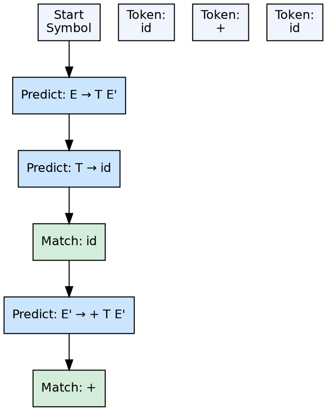

## The Problem

Bottom-up parsers (LR) are powerful but complex to implement manually. For many programming languages, a simpler parsing strategy suffices — one that can be implemented by hand as a set of recursive functions without needing a parser generator.

## Core Idea

Top-down parsing builds the parse tree from the root (start symbol) down to the leaves (tokens). At each step, the parser predicts which production to apply based on the current input token. **Recursive descent** parsers use mutually recursive functions for each non-terminal. **Predictive (LL) parsers** use a parsing table built from FIRST and FOLLOW sets.

## How It Works

The parser starts with the start symbol. For each non-terminal, it looks at the current input token and chooses the production whose FIRST set contains that token. If a production can derive ε, the parser may take that branch when the current token is in the FOLLOW set. In recursive descent, each non-terminal becomes a function that calls other non-terminal functions.

## Visual Explanation

## Key Properties

- **Direction of tree building:** Root → leaves (top-down)
- **Derivation type:** Leftmost derivation
- **Types:** Recursive descent (manual), LL(1) (table-driven), LL(k) (k lookahead)
- **Requirements:** Grammar must not be left-recursive; may need left-factoring
- **Implementation:** Recursive descent is the most common hand-written parsing technique

## Connections

- **Built from:** [[parser-introduction|Parser Introduction]] — top-down is a category of parsing
- **Built from:** [[first-and-follow-sets|FIRST and FOLLOW Sets]] — LL(1) parsers use these sets for prediction table construction
- **Built from:** [[context-free-grammar|Context-Free Grammar]] — the grammar must be transformed (left-recursion removed, factored) for LL parsing
- **Contrasts with:** [[bottom-up-parsing|Bottom-Up Parsing]] — top-down predicts; bottom-up reduces
- **Related:** [[wiki/compilerdesign/ambiguous-grammar|Ambiguous Grammar]] — ambiguity causes multiple valid predictions in LL tables

## Edge Cases & Gotchas

- **Left recursion:** Top-down parsers loop infinitely on A → Aα — must be eliminated before parsing
- **Left factoring:** Common prefixes in alternatives cause FIRST conflicts — factored out to create `A → αB` where `B → β₁ | β₂`
- **LL(1) limitation:** Not all languages can be parsed with LL(1) — some require LL(k) or LR parsing
- **Backtracking:** Naive recursive descent with backtracking has exponential worst-case time; predictive parsing avoids this

## Sources

- [[compilerdesign-summary|Compiler Design Tutorial]] — covers classification of top-down parsers
- [[cd2-summary|Compiler Design for GATE Exam]] — covers recursive descent, predictive parser, LL(1) parsing
