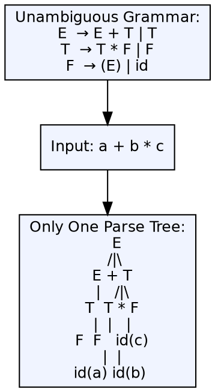

## The Problem

Ambiguous grammars create non-determinism in parsing — the parser doesn't know which parse tree is the intended one. Compilers need grammars where each valid input string has exactly one parse tree to ensure deterministic, predictable compilation.

## Core Idea

An unambiguous grammar is a context-free grammar where every string in the language has exactly one leftmost derivation (and therefore exactly one parse tree). Most programming languages are designed to have unambiguous grammars, or the ambiguity is resolved through additional rules like precedence and associativity.

## How It Works

Unambiguous grammars avoid constructs that create multiple derivations. For example, an unambiguous expression grammar enforces precedence through non-terminal hierarchy: `E → E + T | T`, `T → T * F | F`, `F → id`. The non-terminal levels create a single parse tree for `a + b * c` — multiplication binds tighter than addition because `a + (b * c)` is the only valid derivation.

## Visual Explanation

## Key Properties

- **Unique derivation:** Every valid input has exactly one parse tree
- **Grammar transformation:** Ambiguous grammars can often be rewritten as unambiguous
- **Non-terminal hierarchy:** Enforces precedence through level separation
- **No parsing conflicts:** No shift/reduce or reduce/reduce conflicts from the grammar itself
- **LL and LR:** Unambiguous grammars may still not be LL(1) or LR(1) — parser class is separate from ambiguity

## Connections

- **Contrasts with:** [[ambiguous-grammar|Ambiguous Grammar]] — ambiguous has multiple parse trees; unambiguous has exactly one
- **Built from:** [[context-free-grammar|Context-Free Grammar]] — unambiguous CFGs are a subset of all CFGs
- **Related:** [[top-down-parsing|Top-Down Parsing]] — requires unambiguous grammars for deterministic prediction
- **Related:** [[bottom-up-parsing|Bottom-Up Parsing]] — shift-reduce conflicts signal ambiguity that needs resolution
- **Related:** [[operator-precedence-parser|Operator Precedence Parser]] — resolves expression ambiguity through precedence rules

## Edge Cases & Gotchas

- **Inherently ambiguous languages:** Some languages are inherently ambiguous — every grammar for them is ambiguous (e.g., `{aⁿbⁿcᵐdᵐ | n,m ≥ 0} ∪ {aⁿbᵐcᵐdⁿ | n,m ≥ 0}`)
- **Disambiguating rules:** Yacc/Bison use `%left`, `%right`, `%nonassoc` to resolve ambiguity without rewriting the grammar
- **Ambiguity ≠ non-determinism:** A grammar can be unambiguous but still not parsable by LL(1) or LR(1) — parser class and ambiguity are separate concerns

## Sources

- [[compilerdesign-summary|Compiler Design Tutorial]] — covers ambiguous grammar as a companion concept
