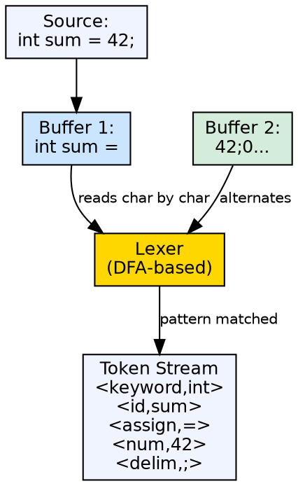
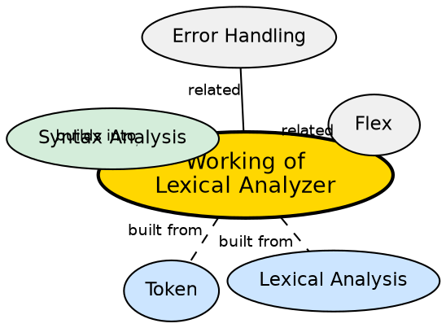

## The Problem

The source program is a raw character stream. The parser cannot consume characters one at a time — it needs a higher-level vocabulary of tokens. The lexical analyzer must efficiently convert characters into tokens while handling whitespace, comments, and input buffering, all without slowing down the compilation process.

## Core Idea

The lexical analyzer reads the source character-by-character, grouping them into tokens using pattern matching against regular expressions. It uses **input buffering** (two-buffer scheme) for efficiency, maintains a **lookahead pointer** for pattern disambiguation, and strips whitespace/comments before passing the token stream to the parser.

## How It Works

The lexer maintains two pointers into the input: `lexemeBegin` (start of current token) and `forward` (current scan position). It scans forward until it finds a pattern match, then records the lexeme. For efficiency, it uses a **double-buffer** scheme: it reads a block of input into buffer 1, then buffer 2, alternating to avoid frequent I/O calls. Sentinel markers (`eof`) at buffer boundaries signal when to refill. The lexer follows maximal munch — always matching the longest possible token.

## Visual Explanation

## Semantic Network

## Key Properties

- **Two-buffer input scheme:** Double buffering hides I/O latency during scanning
- **LexemeBegin + Forward pointers:** Track the current token boundaries
- **Maximal munch:** Always match the longest possible token (e.g., `==` not `=` + `=`)
- **Lookahead:** May need to read one extra character beyond the token to confirm the match
- **Sentinel marking:** Special marker at buffer end triggers refill, avoiding bounds checks per character

## Connections

- **Built from:** [[lexical-analysis|Lexical Analysis]] — the lexer's role as the first compiler phase
- **Built from:** [[token|Token]] — the output unit produced by the lexer
- **Builds into:** [[syntax-analysis|Syntax Analysis]] — parser consumes the token stream
- **Related:** [[flex-lexical-analyzer-generator|Flex]] — automates lexer generation from regex specifications
- **Related:** [[error-handling-in-compiler|Error Handling]] — lexer handles illegal character sequences

## Edge Cases & Gotchas

- **Lookahead rollback:** When a pattern is matched, the forward pointer may be past the token — the lexer must roll back to the token boundary
- **Maximal munch ambiguity:** In C, `++x` is parsed as `++ x` (pre-increment), but `+ +x` is `+ + x` — the lexer chooses the longest match
- **Context-sensitive lexing:** C's `typedef` creates identifiers that are syntactically type names — the lexer may need a symbol table to disambiguate
- **Buffer management:** When a token spans across buffer boundaries (rare but possible), the lexer must handle stitching

## Sources

- [[cd2-summary|Compiler Design for GATE Exam]] — covers the working of lexical analyzer with input buffering and lookahead
