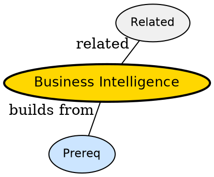

## The Problem

Stakeholders ask what happened but engineers hand them raw tables -- how do you turn warehouse data into decisions?

## Formal Definition

Per Wikipedia: "Business Intelligence is the layer of dashboards, KPIs and self-service queries that sit on top of a warehouse for decision making."

## Explanation

BI is the dashboard of a car -- warehouse is the engine, but driver only sees speed and fuel on the dials.

## How It Works

1. Define KPIs like CLV and RFM
2. Model marts for reporting
3. Build dashboards in BI tool
4. Schedule refresh via automation
5. Share insights with stakeholders

## Visual Explanation


## Semantic Network



## Key Properties

- Self-service reduces ticket load
- Needs governance on metric definitions
- Drill-down needs good dimensional model

## Real-World Example

```python
SELECT rfm_segment, COUNT(*) FROM mart GROUP BY 1
```

## Connections

- **Built from:** [[rfm-segmentation|RFM Segmentation]] -- BI visualizes RFM
- **Built from:** [[customer-lifetime-value|Customer Lifetime Value]] -- KPI source
- **Related:** [[data-warehouse|Data Warehouse]] -- BI consumes warehouse
- **Related:** [[star-schema|Star Schema]] -- BI queries star schema

## Edge Cases & Gotchas

- Vanity metrics -- tracking visits not conversion
- Dashboard sprawl -- 50 dashboards nobody opens
