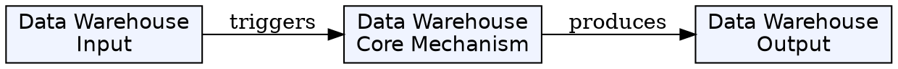
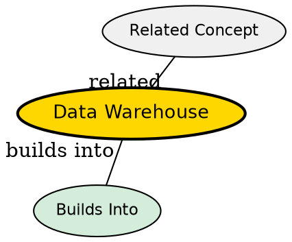

## The Problem
Transactional databases (OLTP) are optimized for row-level writes (INSERT, UPDATE, DELETE), not analytical queries that scan millions of rows. Running complex aggregations on production databases hurts performance and competes with live traffic.

## Core Idea
A data warehouse is a separate analytical database optimized for read-heavy queries. It stores cleaned, transformed data from multiple sources in a structure optimized for aggregations--typically a star schema. It serves as the single source of truth for business intelligence and analytics.

## How It Works
1. **Separate from production**: Warehouse runs on separate hardware/instances to not impact transactional performance
2. **ETL populates warehouse**: ETL pipeline extracts from sources, transforms, loads into warehouse
3. **Star schema design**: Fact tables at center, dimension tables surrounding--for minimal JOINs
4. **Pre-aggregations**: Aggregate tables (like `agg_monthly_revenue`) pre-compute common aggregations
5. **Indexing**: Composite indexes on foreign keys and frequently filtered columns

In FoodFlow:
- PostgreSQL 15 with 5 dimensions, 2 facts, 1 aggregate
- 80,000 orders, ~200,000 order items, 731 dates
- Queries complete in 50-500ms

## Key Properties
- **OLAP optimized**: Columnar storage, bitmap indexes, materialized views
- **Star schema**: Denormalized dimensions for query simplicity
- **Surrogate keys**: Integer keys for faster lookups
- **Pre-aggregated tables**: Materialized summaries for BI dashboard performance
- **Foreign key constraints**: Enforce data integrity

## Visual Explanation

## Semantic Network

## Connections
- Built from: [[wiki/comprehensive-report/star-schema|Star Schema]] -- warehouse uses star schema design
- Built from: [[wiki/comprehensive-report/dimension-table|Dimension Table]] -- warehouse contains dimensions
- Built from: [[wiki/comprehensive-report/fact-table|Fact Table]] -- warehouse contains facts
- Built from: [[etl-pipeline|ETL Pipeline]] -- ETL populates warehouse
- Related: [[sql-database|SQL Database]] -- warehouse is implemented on SQL database

## Edge Cases & Gotchas
- **Separate database**: Need connection string, credentials, network access
- **Data freshness**: Batch-loaded data is inherently stale--in production consider streaming
- **Storage cost**: Duplicate data (source + warehouse) doubles storage needs
- **Query performance**: Without proper indexes, analytical queries can be slow