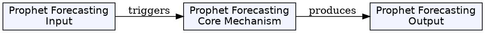
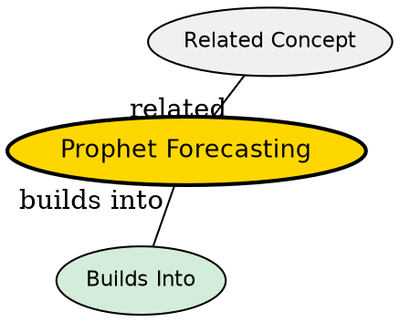

## The Problem
Business users need to know future demand--how many orders will arrive tomorrow, next week, next month. Traditional statistical methods (ARIMA, SARIMA) require manual parameter tuning, handle missing data poorly, and don't automatically detect changepoints.

## Core Idea
Facebook Prophet is a time-series forecasting library designed for business data with strong seasonal patterns. It automatically detects trend changes, models weekly/yearly seasonality, and handles missing data gracefully--unlike ARIMA which requires complete data series.

## How It Works
1. **Training data**: Aggregate daily counts (delivered orders) with dates as `ds` and counts as `y`
2. **Model configuration**:
   - `changepoint_prior_scale`: Controls trend flexibility (higher = more adaptive)
   - `seasonality_mode="multiplicative"`: Seasonal patterns scale with trend level
   - Enable weekly and yearly seasonality
3. **Custom regressors**: Add `is_weekend` flag as external regressor
4. **Forecast generation**: `m.make_future_dataframe(periods=30)` creates future dates
5. **Output**: Point estimates (yhat) with confidence intervals (yhat_lower, yhat_upper)
6. **Evaluation**: MAPE, MAE, RMSE on in-sample fit

```python
m = Prophet(
    changepoint_prior_scale=0.15,
    seasonality_mode="multiplicative",
    weekly_seasonality=True,
    yearly_seasonality=True,
)
m.add_regressor("is_weekend")
m.fit(df)
future = m.make_future_dataframe(periods=30)
forecast = m.predict(future)
```

## Key Properties
- **Automatic changepoint detection**: Finds where trend changes significantly
- **Handles missing data**: Unlike ARIMA which requires complete series
- **Multiplicative seasonality**: Seasonal effects scale with trend--realistic for growing businesses
- **Interpretable components**: Trend, weekly seasonality, yearly seasonality
- **Confidence intervals**: Provides uncertainty bounds for decisions


## Visual Explanation



## Semantic Network


## Connections
- Related: [[data-warehouse|Data Warehouse]] -- forecasts stored in warehouse
- Related: [[etl-pipeline|ETL Pipeline]] -- ML forecast runs after ETL
- Related: [[apache-airflow|Apache Airflow]] -- Airflow orchestrates forecast scheduling

## Edge Cases & Gotchas
- **In-sample evaluation only**: MAPE/MAE/RMSE on training data overestimates quality--need holdout set
- **No baseline comparison**: Can't tell if Prophet beats naive forecast without comparison
- **Limited regressors**: Only `is_weekend` used--could benefit from holidays, promotions
- **Single model**: No model versioning or A/B testing