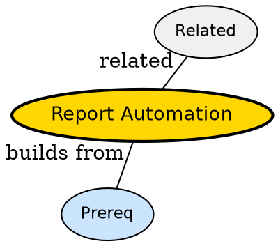

## The Problem

Manual reports take days to refresh -- how do you keep dashboards live without emailing spreadsheets?

## Formal Definition

Per Wikipedia: "Report automation schedules ETL pipelines to refresh fact and dimension tables and rebuild downstream reports on a cron or event trigger."

## Explanation

Like an alarm that fills your fridge before breakfast -- pipeline runs nightly so dashboard is fresh in morning.

## How It Works

1. Orchestrator triggers ETL at schedule
2. Extract pulls from sources
3. Transform joins facts/dims
4. Load into warehouse star schema
5. BI tool refreshes dashboard

## Visual Explanation


## Semantic Network



## Key Properties

- Reduces manual error
- Requires idempotent loads
- Needs monitoring for late data
- Often built with Airflow

## Real-World Example

```python
from airflow import DAG
with DAG('daily_report'): pass # schedule ETL
```

## Connections

- **Built from:** [[etl-pipeline|ETL Pipeline]] -- automation wraps ETL
- **Built from:** [[star-schema|Star Schema]] -- loads into star schema
- **Related:** [[apache-airflow|Apache Airflow]] -- orchestrator
- **Related:** [[data-warehouse|Data Warehouse]] -- warehouse is target

## Edge Cases & Gotchas

- Backfills overwrite if not partitioned
- Silent schema drift breaks loads
