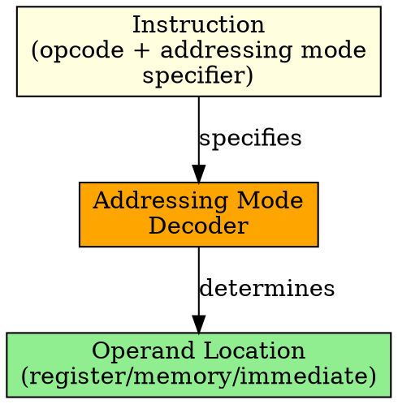

## The Problem
CPU instructions need to know where to find their operands (the data they operate on). Operands could be in registers, memory, or embedded in the instruction itself. How does the CPU know which one?

## Core Idea
Addressing Mode defines how a CPU instruction specifies the location of its operands — whether in registers, memory, or as immediate values embedded in the instruction.

## How It Works
1. Instruction encoding includes opcode (what to do) and addressing mode specifier (where data is)
2. CPU decodes the addressing mode to determine how to fetch operands
3. Different modes: immediate (value in instruction), register (in register), direct (memory address in instruction), etc.
4. Complex modes combine: base + index, base + displacement
5. Programmer/compiler chooses addressing mode based on data location and access pattern

## Key Properties
- Makes CPU instructions flexible and powerful
- Different modes for different use cases (constants, arrays, structs, etc.)
- More addressing modes = more complex instruction decoding
- Choice of addressing mode affects instruction length and execution speed

## Connections
- **Built from:** [[instruction-set|Instruction Set]], [[cpu|CPU]], [[operand|Operand]]
- **Builds into:** [[immediate-addressing|Immediate Addressing]], [[register-addressing|Register Addressing]], [[direct-addressing|Direct Addressing]]
- **Builds into:** [[indirect-addressing|Indirect Addressing]], [[indexed-addressing|Indexed Addressing]]
- **Related:** [[effective-address|Effective Address]], [[memory-address|Memory Address]]

## Edge Cases & Gotchas
- More addressing modes = more complex hardware (decoder logic)
- Some modes are slower (indirect, indexed) due to extra memory accesses
- Not all CPUs support all addressing modes (RISC typically has fewer)
- Invalid addressing mode encoding causes illegal instruction exception