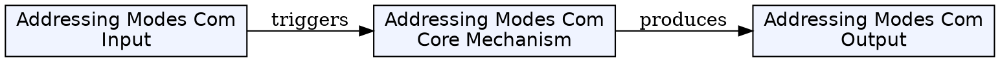
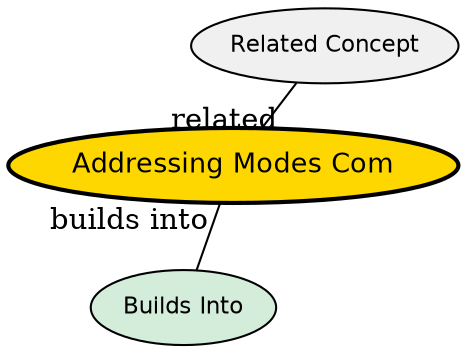

## The Comparison

Different addressing modes exist to efficiently access data in different scenarios: constants, registers, fixed memory locations, arrays, structs, and control flow.

## Side-by-Side Comparison

| Mode | Operand Location | Example | Speed | Use Case |
|------|-----------------|---------|------|----------|
| **Immediate** | In instruction (constant) | MOV AX, 5 | Fastest (no mem access) | Constants, initialization |
| **Register** | CPU register | MOV AX, BX | Fastest (no mem access) | Temp values, frequent access |
| **Direct** | Fixed memory address | MOV AX, [1234h] | Fast (1 mem access) | Global variables |
| **Indirect** | Address in register | MOV AX, [BX] | Medium (2 mem accesses) | Pointers, dynamic data |
| **Indexed** | Base + index register | MOV AX, [1000h+SI] | Medium (calc + mem) | Arrays, tables |
| **Register+Disp** | Register + constant | MOV AX, [BX+4] | Medium (calc + mem) | Struct fields, stack vars |
| **Relative** | PC + offset | JMP 10 | Medium (calc + mem) | Branches, jumps |
| **Stack** | Top of stack | PUSH AX, POP BX | Fast (SP is register) | Function calls, expressions |

## Key Insights

1. **Fastest modes**: Immediate and Register addressing (no memory access beyond instruction fetch).

2. **Most flexible**: Indirect, Indexed, and Register+Displacement enable dynamic data access (arrays, structs, pointers).

3. **Control flow**: Relative addressing is essential for position-independent code (branches, function calls).

4. **Stack addressing**: Implicit addressing (no address in instruction) -- used for function calls, local variables, expression evaluation.

5. **Trade-off**: More complex addressing = more hardware (address calculation logic) but more flexible programs.

## Visual Explanation

## Semantic Network

## Connections
- [[immediate-addressing|Immediate Addressing]] -- constants in instruction
- [[register-addressing|Register Addressing]] -- operands in registers
- [[direct-addressing|Direct Addressing]] -- fixed memory address
- [[indirect-addressing|Indirect Addressing]] -- address in register
- [[indexed-addressing|Indexed Addressing]] -- base + index for arrays
- [[register-indirect-with-displacement|Register+Displacement]] -- struct fields
- [[relative-addressing|Relative Addressing]] -- PC-relative branches
- [[stack-addressing|Stack Addressing]] -- stack operations