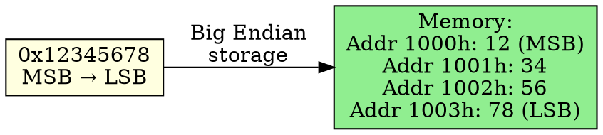

# Big Endian

## The Problem
When storing multi-byte values in memory, we need a consistent convention for byte order. Some systems store the most significant byte first to match human reading order.

## Core Idea
Big Endian stores the Most Significant Byte (MSB) at the lowest memory address, with remaining bytes stored in decreasing significance order.

## How It Works
1. Take a 32-bit number: `0x12345678` (bytes: 12=MSB, 34, 56, 78=LSB)
2. Store MSB (0x12) at lowest address (e.g., 1000h)
3. Store next byte (0x34) at next address (1001h)
4. Continue until LSB (0x78) at highest address (1003h)
5. Memory dump reads left-to-right like human writing: `12 34 56 78`

## Key Properties
- Matches human reading order (easier to debug in memory dumps)
- Standard for network protocols (TCP/IP uses Big Endian = "network byte order")
- Used by: Motorola 68k, SPARC (sometimes), PowerPC (can be bi-endian)
- Easier to interpret hex dumps visually

## Connections
- **Contrasts with:** [[little-endian|Little Endian]] — stores LSB first
- **Built from:** [[endianness|Endianness]], [[memory|Memory]]
- **Builds into:** [[network-byte-order|Network Byte Order]] — TCP/IP mandates Big Endian
- **Related:** [[motorola-68k|Motorola 68k]], [[sparc|Sparc]]

## Edge Cases & Gotchas
- Less efficient for x86 CPUs (must convert to Little Endian for arithmetic)
- Conversion needed when receiving network data on Little Endian systems
- Not all RISC chips use Big Endian (ARM is Little Endian, MIPS can be either)

## Sources
- [[computer-architecture-summary|Computer Architecture Source Summary]]
