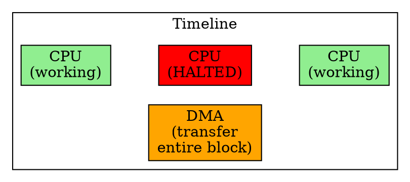

## The Problem
DMA transfers need to balance between fast data movement and not blocking the CPU. If the DMA controller transfers too slowly, the I/O device may underrun; if it hogs the bus, the CPU can't work.

## Core Idea
Burst Mode DMA transfers the entire block of data in one continuous operation, with the DMA controller holding exclusive control of the system bus until the transfer completes.

## How It Works
1. DMA controller requests and gains exclusive bus control
2. Entire data block is transferred continuously, one word/byte at a time
3. CPU is paused/halted during the entire transfer — cannot access memory or bus
4. When transfer completes, DMA releases the bus and sends interrupt to CPU

## Key Properties
- Fastest DMA mode for the transfer itself — no interruptions
- CPU is completely blocked during transfer (can't even access cache if it misses)
- Best for high-priority, time-sensitive transfers (real-time systems)
- Simple to implement — no need for interleaving logic

## Connections
- **Built from:** [[dma|DMA]], [[dma-controller|DMA Controller]]
- **Contrasts with:** [[cycle-stealing-mode-dma|Cycle Stealing Mode DMA]] — CPU can work between transfers
- **Contrasts with:** [[transparent-mode-dma|Transparent Mode DMA]] — DMA only runs when CPU not using bus
- **Related:** [[polling|Polling]] — CPU also blocked in polling, but for different reasons

## Edge Cases & Gotchas
- Long bursts can cause CPU starvation — system becomes unresponsive
- Not suitable for systems requiring low-latency CPU response
- Some systems limit maximum burst size to prevent excessive CPU blocking
- Cache coherency issues still apply — CPU cache may be stale after burst

## Sources
- [[computer-architecture-summary|Computer Architecture Source Summary]]
