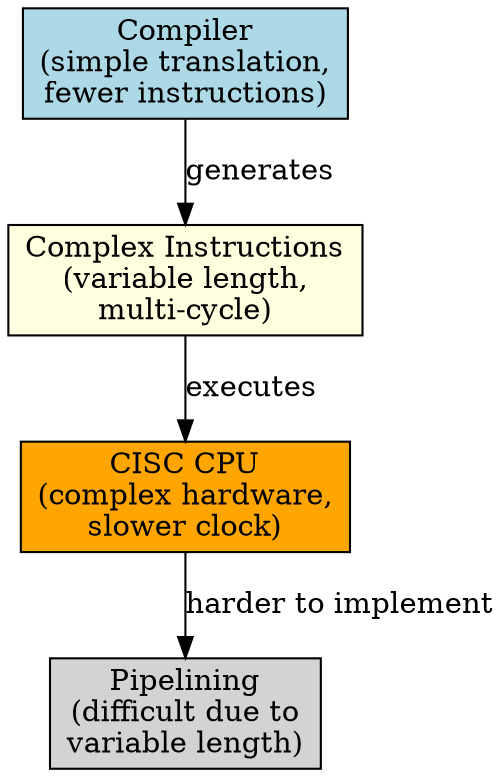

# CISC Architecture

## The Problem
Early CPUs had few registers and slow memory. To make programming easier and code smaller, can we put complex operations (like "load, add, store" all in one instruction) directly in hardware?

## Core Idea
CISC (Complex Instruction Set Computer) uses a large set of complex instructions where a single instruction can perform multi-step operations (e.g., load from memory, add, and store — all in one instruction).

## How It Works
1. CPU has a large set of instructions (hundreds), some very complex
2. Instructions have variable length (1 to 15+ bytes) — harder to decode
3. Complex instructions take multiple clock cycles to execute
4. Hardware handles complex operations — less work for compiler/software
5. Fewer instructions per program, but each instruction does more work

## Key Properties
- Large instruction set (hundreds of instructions)
- Variable instruction length (1-15+ bytes, harder to decode)
- Multiple clock cycles per instruction
- Complex hardware (more transistors, harder to design)
- Smaller programs (fewer instructions needed)

## Connections
- **Contrasts with:** [[risc-architecture|RISC Architecture]] — simple instructions, software does more work
- **Built from:** [[cpu|CPU]], [[instruction-set|Instruction Set]], [[clock-cycle|Clock Cycle]]
- **Builds into:** [[micro-ops|Micro-ops]] — modern x86 translates CISC to RISC-like internally
- **Related:** [[x86-architecture|x86 Architecture]], [[intel-cpu|Intel CPU]]

## Edge Cases & Gotchas
- Pipelines are harder to implement due to variable instruction length
- Slower clock speeds due to complex hardware
- Many instructions are rarely used (wasted silicon)
- Modern x86 CPUs are "RISC inside" — they translate CISC instructions to micro-ops

## Sources
- [[computer-architecture-summary|Computer Architecture Source Summary]]
