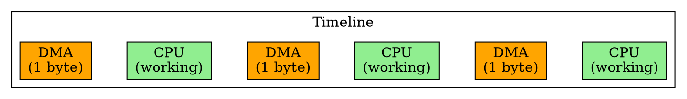
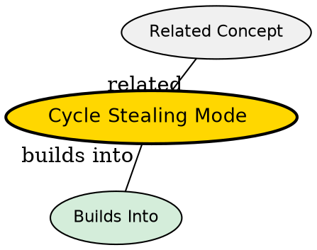

## The Problem
Burst Mode DMA blocks the CPU entirely during transfer, which can cause system unresponsiveness. But we still want DMA's benefit of freeing the CPU from handling each byte. We need a middle ground.

## Core Idea
Cycle Stealing Mode DMA transfers one byte or word at a time, then releases the bus to let the CPU run momentarily between transfers, balancing throughput with CPU responsiveness.

## How It Works
1. DMA controller takes bus, transfers one byte/word
2. DMA releases bus to CPU
3. CPU can access memory/run for a few cycles
4. DMA requests bus again, transfers next byte/word
5. Repeat until entire block is transferred

## Key Properties
- Slower than burst mode (more bus arbitration overhead per byte)
- CPU is not fully halted -- can respond to interrupts, do useful work
- Good balance between transfer speed and system responsiveness
- Most common DMA mode in general-purpose systems

## Semantic Network

## Connections
- **Built from:** [[dma|DMA]], [[dma-controller|DMA Controller]]
- **Contrasts with:** [[burst-mode-dma|Burst Mode DMA]] -- CPU fully blocked during transfer
- **Contrasts with:** [[transparent-mode-dma|Transparent Mode DMA]] -- DMA only runs when CPU not using bus
- **Related:** [[cpu|CPU]], [[system-bus|System Bus]]

## Edge Cases & Gotchas
- More bus arbitration overhead than burst mode -- each transfer needs bus request/grant
- If CPU is very active, DMA transfer can take a long time (many cycles "stolen")
- I/O device may underrun if DMA can't keep up due to CPU bus usage