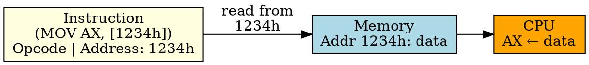

## The Problem
We need to access specific memory locations (variables, data structures). Embedding the memory address directly in the instruction allows the CPU to access that fixed location.

## Core Idea
Direct Addressing specifies the exact memory address of the operand within the instruction. The CPU reads/writes to that specific memory location.

## How It Works
1. Instruction includes the memory address (e.g., 1234h)
2. CPU fetches the instruction, extracts the address
3. CPU performs a memory read/write to that address
4. Example: `MOV AX, [1234h]` — loads data from memory address 1234h into AX
5. Requires one memory access (in addition to instruction fetch)

## Key Properties
- Simple and intuitive — address is fixed at compile time
- Limited address range: address size limited by instruction format
- Used for accessing global variables, fixed data structures
- Slower than register addressing (requires memory access)

## Connections
- **Built from:** [[addressing-mode|Addressing Mode]], [[memory-address|Memory Address]]
- **Contrasts with:** [[immediate-addressing|Immediate Addressing]] — value in instruction, not address
- **Contrasts with:** [[indirect-addressing|Indirect Addressing]] — address in register, not instruction
- **Related:** [[memory|Memory]], [[effective-address|Effective Address]]

## Edge Cases & Gotchas
- Address is fixed at compile time (can't change at runtime)
- Limited address range (e.g., 16-bit address = 64KB max)
- Position-independent code can't use direct addressing (addresses change)

## Sources
- [[computer-architecture-summary|Computer Architecture Source Summary]]
