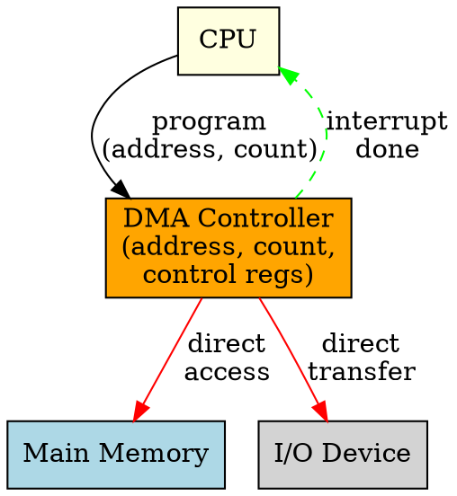

# DMA Controller

## The Problem
The CPU should not waste cycles copying data between I/O devices and memory. But without a dedicated hardware controller, there's no way to transfer data directly — someone (the CPU) must handle each byte.

## Core Idea
The DMA Controller (DMAC) is a specialized hardware component that manages data transfers between I/O devices and memory without CPU intervention, using bus mastering to directly access memory.

## How It Works
1. CPU programs the DMAC with: source address, destination address, transfer count
2. DMAC takes control of the system bus (bus arbitration)
3. DMAC generates memory addresses and transfer signals
4. Data moves directly between device and memory via DMAC
5. DMAC decrements count for each transfer, increments addresses
6. When count reaches zero, DMAC raises an interrupt to notify CPU

## Key Properties
- Contains registers for source address, destination address, transfer count, control
- Can operate in different modes (burst, cycle stealing, transparent)
- Requires bus arbitration logic to coordinate with CPU for bus access
- Typically supports multiple channels for different devices

## Connections
- **Built from:** [[system-bus|System Bus]], [[device-controller|Device Controller]]
- **Builds into:** [[dma|DMA]] — DMAC is the hardware that implements DMA
- **Related:** [[io-devices|I/O Devices]], [[buffering|Buffering]]
- **Contrasts with:** [[cpu|CPU]] — DMAC handles transfers, CPU free to do other work

## Edge Cases & Gotchas
- Bus contention: CPU and DMAC both need bus access — arbitration required
- Cache coherency: CPU cache may not see DMAC-written data (need cache flush/invalidate)
- Wrong register programming (bad address/count) can corrupt memory
- Some systems have limited DMA channels — resource contention possible

## Sources
- [[computer-architecture-summary|Computer Architecture Source Summary]]
