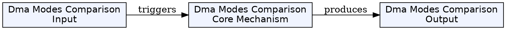
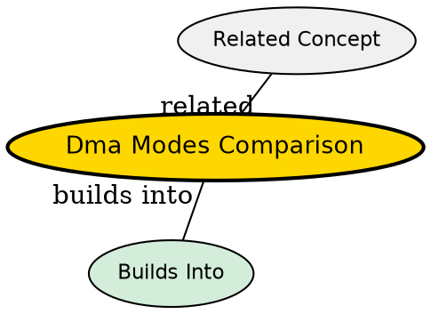

## The Comparison

DMA can operate in three different modes, each balancing transfer speed, CPU responsiveness, and implementation complexity differently.

## Side-by-Side Comparison

| Feature | Burst Mode | Cycle Stealing Mode | Transparent Mode |
|---------|-------------|---------------------|------------------|
| **Transfer style** | Entire block at once | One byte/word at a time | Only when CPU not using bus |
| **CPU status** | Paused/halted until DMA finishes | Can work between transfers | Never blocked |
| **Transfer speed** | Fastest (no interruptions) | Slower (bus arbitration per byte) | Slowest (limited by CPU idle time) |
| **CPU responsiveness** | Worst (completely blocked) | Good (can respond to interrupts) | Best (completely transparent) |
| **Implementation** | Simple | Moderate | Complex (needs bus monitoring) |
| **Use case** | High-priority, time-critical | General-purpose systems | Background transfers |

## Visual Timeline

**Burst Mode**: CPU → [██████ DMA ██████] → CPU
**Cycle Stealing**: CPU → DMA → CPU → DMA → CPU → DMA → CPU
**Transparent**: CPU → CPU → DMA → CPU → CPU → DMA → CPU

## Key Insights

1. **Burst Mode**: Best for real-time systems where transfer speed matters more than CPU responsiveness. CPU is fully blocked.

2. **Cycle Stealing**: The most common mode -- balances transfer speed with CPU responsiveness. CPU can handle interrupts between DMA transfers.

3. **Transparent Mode**: Zero CPU overhead, but slowest. Good for background tasks where completion time doesn't matter.

4. **Trade-off**: Faster transfer = more CPU blocking. The system's requirements determine which mode to use.

## Visual Explanation

## Semantic Network

## Connections
- [[burst-mode-dma|Burst Mode DMA]] -- entire block, CPU blocked
- [[cycle-stealing-mode-dma|Cycle Stealing Mode DMA]] -- one at a time, CPU works between
- [[transparent-mode-dma|Transparent Mode DMA]] -- only when CPU idle
- [[dma|DMA]] -- the underlying mechanism
- [[dma-controller|DMA Controller]] -- hardware that implements these modes
- [[cpu|CPU]] -- affected differently by each mode