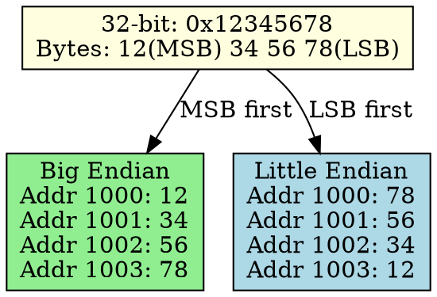

## The Problem
Multi-byte data (16-bit, 32-bit, 64-bit numbers) must be stored in memory as individual bytes. But which byte goes at the lowest memory address — the most significant or least significant byte?

## Core Idea
Endianness defines the byte order used to store multi-byte data in memory: Big Endian puts the Most Significant Byte first; Little Endian puts the Least Significant Byte first.

## How It Works
1. A 32-bit number like `0x12345678` has 4 bytes: 0x12 (MSB), 0x34, 0x56, 0x78 (LSB)
2. Big Endian stores: `12 34 56 78` at increasing memory addresses
3. Little Endian stores: `78 56 34 12` at increasing memory addresses
4. When reading multi-byte data, CPU must know the correct byte order
5. Mismatch between systems causes data corruption (e.g., network data on x86)

## Key Properties
- Big Endian: matches human reading order (easier to debug in memory dumps)
- Little Endian: more efficient for CPU arithmetic (LSB processed first on x86)
- Network protocols use Big Endian (called "network byte order")
- Intel x86/AMD use Little Endian; some RISC chips use Big Endian

## Connections
- **Built from:** [[memory|Memory]], [[multi-byte-data|Multi-Byte Data]]
- **Contrasts with:** [[big-endian|Big Endian]] vs [[little-endian|Little Endian]] — different byte orders
- **Related:** [[network-byte-order|Network Byte Order]], [[memory-address|Memory Address]]
- **Builds into:** [[data-serialization|Data Serialization]] — must handle endianness when transferring data

## Edge Cases & Gotchas
- Endianness only matters for multi-byte data (byte-order sensitive)
- Single bytes are not affected by endianness
- Mixing systems with different endianness causes data corruption
- Some CPUs are bi-endian (can switch mode) — software must track current mode

## Sources
- [[computer-architecture-summary|Computer Architecture Source Summary]]
