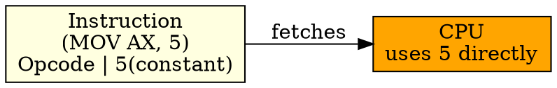

## The Problem
Some operands are constants (like initializing a register to 5). Having to store the constant in memory and then load it wastes time and memory. Can we put the constant directly in the instruction?

## Core Idea
Immediate Addressing embeds the operand value directly inside the instruction itself. The CPU uses this constant value as-is, with no memory access needed.

## How It Works
1. Instruction format: `OPCODE + CONSTANT_VALUE`
2. CPU fetches instruction from memory
3. Constant value is part of the instruction (in the operand field)
4. CPU uses the constant directly — no additional memory fetch
5. Example: `MOV AX, 5` — moves the constant 5 into register AX

## Key Properties
- Fastest addressing mode (no memory access for operand)
- Instruction is longer (includes the constant value)
- Constant is fixed at compile time (can't change at runtime)
- Used for initializing registers, constants, small values

## Connections
- **Built from:** [[addressing-mode|Addressing Mode]], [[operand|Operand]]
- **Contrasts with:** [[direct-addressing|Direct Addressing]] — address in instruction, not value
- **Related:** [[register-addressing|Register Addressing]], [[instruction-set|Instruction Set]]
- **Builds into:** [[program-counter|Program Counter]] — instruction fetch includes immediate data

## Edge Cases & Gotchas
- Large constants make instructions longer (affects code size)
- Constant can't be changed at runtime (it's part of the instruction)
- Limited range: constant size limited by instruction format (e.g., 16-bit immediate)

## Sources
- [[computer-architecture-summary|Computer Architecture Source Summary]]
