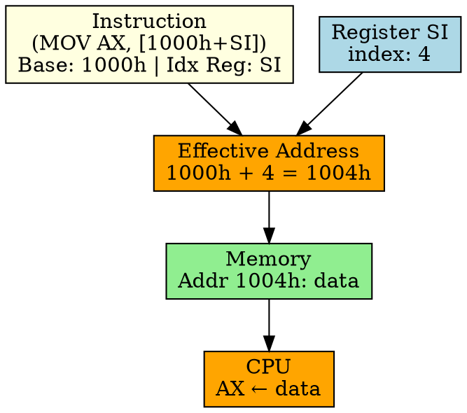

## The Problem
Arrays and tables store data sequentially. Accessing array[i] requires computing address = base + i. Can the CPU compute this automatically during addressing?

## Core Idea
Indexed Addressing computes the effective address by adding a base address (from instruction) and an index value (from a register). Perfect for accessing array elements and table lookups.

## How It Works
1. Instruction specifies base address (e.g., 1000h) and index register (e.g., SI)
2. CPU reads index register to get offset value
3. Effective address = base address + index
4. CPU accesses memory at the computed address
5. Example: `MOV AX, [1000h + SI]` — SI is index, accesses memory at (1000h + SI)

## Key Properties
- Ideal for array access: base = array start, index = element offset
- Index register can be incremented in loops (efficient array traversal)
- Requires address computation (slightly slower than simpler modes)
- Used in loops, array processing, table lookups

## Connections
- **Built from:** [[addressing-mode|Addressing Mode]], [[indirect-addressing|Indirect Addressing]]
- **Related:** [[array|Array]], [[loop|Loop]], [[effective-address|Effective Address]]
- **Builds into:** [[register-indirect-with-displacement|Register Indirect with Displacement]]
- **Contrasts with:** [[direct-addressing|Direct Addressing]] — no index computation

## Edge Cases & Gotchas
- Index register must be set correctly before use (common bug: forgetting to increment)
- Address calculation may overflow (base + index exceeds address space)
- Requires more hardware (adder for address calculation)