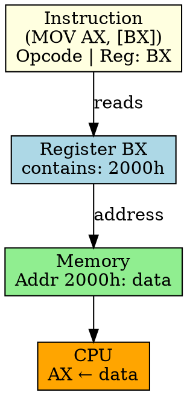

## The Problem
Direct addressing uses a fixed address in the instruction. But what if the address isn't known until runtime (e.g., pointers, dynamic memory)? We need a way to specify an address that can change.

## Core Idea
Indirect Addressing specifies a register (or memory location) that holds the address of the operand. The CPU first reads the register to get the address, then accesses memory at that address.

## How It Works
1. Instruction specifies a register (e.g., BX) that contains the address
2. CPU reads the register to get the memory address
3. CPU performs memory access using that address
4. Example: `MOV AX, [BX]` — BX holds address, CPU reads memory at (BX) and loads into AX
5. Requires two memory accesses: one for instruction, one for operand

## Key Properties
- Address can be computed at runtime (pointers, dynamic allocation)
- Used for arrays, linked lists, pointers
- Slower than direct addressing (extra register read, still needs memory access)
- Foundation for more complex addressing modes (indexed, displacement)

## Connections
- **Built from:** [[addressing-mode|Addressing Mode]], [[cpu-register|CPU Register]]
- **Contrasts with:** [[direct-addressing|Direct Addressing]] — fixed address in instruction
- **Builds into:** [[indexed-addressing|Indexed Addressing]], [[register-indirect-with-displacement|Register Indirect with Displacement]]
- **Related:** [[pointer|Pointer]], [[memory-address|Memory Address]]

## Edge Cases & Gotchas
- Register must contain valid address (null/invalid pointer causes exception)
- Two memory accesses: slower than direct addressing
- Register value can change at runtime (unlike direct addressing)