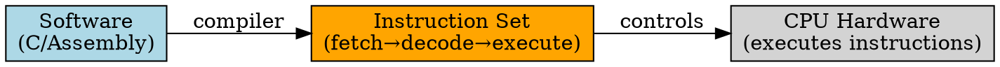

## The Problem
Software needs a way to tell the CPU what to do. The set of operations a CPU supports defines what programs can do and how efficiently they run.

## Core Idea
The instruction set is the complete collection of machine-level instructions that a CPU can execute — it defines the boundary between software and hardware.

## How It Works
1. Each instruction specifies an operation (add, load, branch, etc.) and operands (registers, memory addresses, constants)
2. CPU fetches instructions from memory, decodes them, and executes them
3. Instruction set architecture (ISA) defines: instruction formats, registers, memory model, addressing modes
4. Compiler translates high-level code to instructions in this set
5. RISC has few simple instructions; CISC has many complex ones

## Key Properties
- Defines CPU's machine language (binary encoding of instructions)
- RISC: small, simple, fixed-length; CISC: large, complex, variable-length
- Includes data movement, arithmetic, logic, control flow instructions
- ISA is a contract — software depends on it, hardware implements it

## Connections
- **Built from:** [[cpu|CPU]], [[addressing-mode|Addressing Mode]]
- **Builds into:** [[risc-architecture|RISC Architecture]], [[cisc-architecture|CISC Architecture]]
- **Related:** [[instruction-set-architecture|ISA]], [[compiler|Compiler]]
- **Contrasts with:** Different ISAs are not directly compatible (x86 vs ARM)

## Edge Cases & Gotchas
- ISA is not implementation — two CPUs with same ISA can have different performance
- Backward compatibility: new CPUs must support old ISA (lots of legacy baggage)
- Modern CPUs may add extensions (SSE, AVX, NEON) to base ISA

## Sources
- [[computer-architecture-summary|Computer Architecture Source Summary]]
