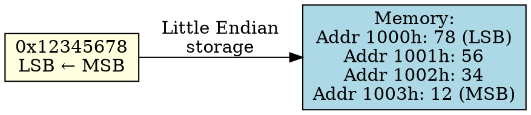

## The Problem
When storing multi-byte values in memory, some systems prefer to store the least significant byte first, making arithmetic operations more efficient since the CPU processes from low to high.

## Core Idea
Little Endian stores the Least Significant Byte (LSB) at the lowest memory address, with remaining bytes stored in increasing significance order.

## How It Works
1. Take a 32-bit number: `0x12345678` (bytes: 12=MSB, 34, 56, 78=LSB)
2. Store LSB (0x78) at lowest address (e.g., 1000h)
3. Store next byte (0x56) at next address (1001h)
4. Continue until MSB (0x12) at highest address (1003h)
5. Memory dump reads "backwards" from human perspective: `78 56 34 12`

## Key Properties
- Efficient for CPU arithmetic — can process LSB first (natural for x86)
- Most common in personal computers (Intel x86, AMD64)
- Harder to read in memory dumps (bytes appear reversed)
- Conversion needed for network communication (network byte order is Big Endian)

## Connections
- **Contrasts with:** [[big-endian|Big Endian]] — stores MSB first
- **Built from:** [[endianness|Endianness]], [[memory|Memory]]
- **Related:** [[x86-architecture|x86 Architecture]], [[intel-cpu|Intel CPU]]
- **Builds into:** [[network-byte-order|Network Byte Order]] — must convert LE to BE for network

## Edge Cases & Gotchas
- Harder for humans to debug (memory dump shows reversed bytes)
- Must convert to Big Endian when sending data over network
- Casting tricks: `(char*)&int32` gives LSB directly on Little Endian (not portable!)