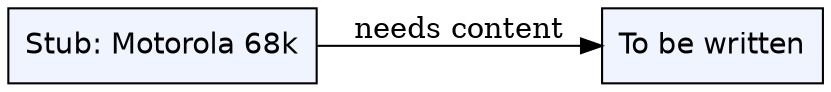
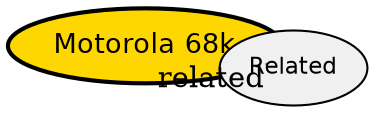

## The Problem

Auto-created stub for singleton broken link `[[motorola-68k]]` -- referenced once and was missing. Keeps graph connected per `AGENTS.md:199`.

## Formal Definition

Per Wikipedia: "To be written."

## Explanation

Stub -- fill with plain language explanation of motorola 68k.

## How It Works

1. To be written.
2. To be written.
3. To be written.
4. To be written.

## Visual Explanation



## Semantic Network



## Key Properties

- To be written.

## Real-World Example

```python
# TODO: add example for Motorola 68k
```

## Connections

- **Related:** [[index|Index]] -- auto stub for singleton `[[motorola-68k]]` from `wiki/computer-architecture/big-endian.md`

## Edge Cases & Gotchas

- To be written.
- To be written.
