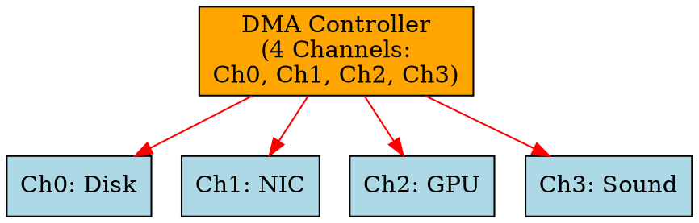

## The Problem
Single-channel DMA creates a bottleneck when multiple I/O devices need to transfer data simultaneously. Modern systems have many devices (disk, NIC, GPU, sound, etc.) that all need efficient data transfer.

## Core Idea
Multi-Channel DMA provides multiple independent DMA channels, each with its own set of registers, allowing multiple devices to perform DMA transfers concurrently.

## How It Works
1. Each device is assigned a dedicated DMA channel (or shares channels via arbitration)
2. CPU programs each channel independently with its transfer parameters
3. Multiple channels can transfer data simultaneously (subject to bus bandwidth)
4. Each channel has its own completion interrupt or shares an interrupt with status bits

## Key Properties
- Multiple concurrent DMA transfers — better system throughput
- More complex hardware — multiple register sets, arbitration logic
- Standard in modern systems (e.g., PC DMA controllers have 4-8 channels)
- Channels can have different priorities

## Connections
- **Built from:** [[dma|DMA]], [[dma-controller|DMA Controller]]
- **Contrasts with:** [[single-channel-dma|Single-Channel DMA]] — only one device can use DMA at a time
- **Related:** [[io-devices|I/O Devices]], [[device-controller|Device Controller]]
- **Builds into:** [[buffering|Buffering]] — works alongside multi-channel DMA

## Edge Cases & Gotchas
- Bus contention: multiple channels transferring simultaneously can saturate memory bus
- More expensive to implement than single-channel DMA
- Channel allocation: need strategy to assign channels to devices (static vs dynamic)
- Some channels may be reserved for specific devices (e.g., cascade channel)

## Sources
- [[computer-architecture-summary|Computer Architecture Source Summary]]
