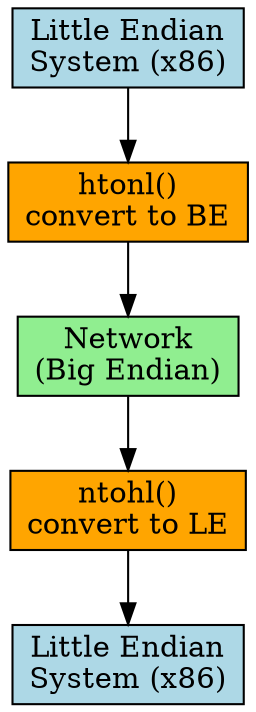

# Network Byte Order

## The Problem
Different computer architectures use different byte orders (endianness). When two systems with different endianness communicate over a network, multi-byte values get corrupted unless there's a standard byte order.

## Core Idea
Network Byte Order is Big Endian — the standard byte order mandated by TCP/IP protocols for all data transmitted over the network, ensuring interoperability between different architectures.

## How It Works
1. TCP/IP protocols (IP, TCP, UDP, etc.) define all multi-byte fields in Big Endian
2. Little Endian systems (x86) must convert to Big Endian before sending
3. Receiving system converts from Big Endian to its native byte order
4. Conversion functions: `htons()`, `htonl()` (host-to-network), `ntohs()`, `ntohl()` (network-to-host)
5. Single-byte data is not affected (no byte order for 1 byte)

## Key Properties
- Defined as Big Endian (MSB first)
- Used by all TCP/IP protocols (IPv4, IPv6, TCP, UDP, etc.)
- Requires conversion on Little Endian systems (Intel x86/AMD)
- Part of socket API (Berkeley sockets standard)

## Connections
- **Built from:** [[big-endian|Big Endian]], [[endianness|Endianness]]
- **Contrasts with:** [[little-endian|Little Endian]] — x86 uses LE, network uses BE
- **Related:** [[tcp-ip-model|Tcp Ip Model]], [[socket|Socket]]
- **Builds into:** [[data-serialization|Data Serialization]] — must handle network byte order

## Edge Cases & Gotchas
- Forgetting to convert causes silent data corruption (no error, wrong values)
- Only matters for multi-byte data (don't convert single bytes!)
- Some protocols (like HTTP) use text, not binary — no endianness issue
- Modern systems: always use `htons()`/`htonl()` even if same endianness (portable code)

## Sources
- [[computer-architecture-summary|Computer Architecture Source Summary]]
