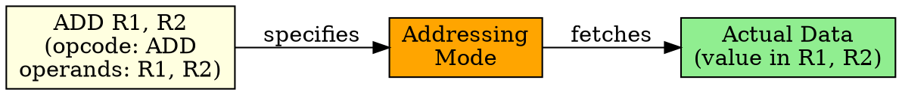

## The Problem
CPU instructions perform operations (add, subtract, load, store). But on what data? Instructions need to specify the data they operate on — the operands.

## Core Idea
An operand is the data or the location of data that a CPU instruction operates on. It can be a value, a register, or a memory address, depending on the addressing mode.

## How It Works
1. Instruction specifies one or more operands (e.g., ADD R1, R2 — R1 and R2 are operands)
2. Addressing mode determines how CPU interprets each operand
3. Operand can be: immediate value (constant), register name, memory address, or computed address
4. CPU fetches operands based on addressing mode, then executes the operation
5. Result may be stored in a destination operand

## Key Properties
- Instructions can have 0 to 3+ operands (depends on ISA: 0-operand, 1-operand, 2-operand, 3-operand)
- Operand type determined by addressing mode
- RISC typically uses 3-operand instructions; CISC often 2-operand
- Operands can be source (input) or destination (output)

## Connections
- **Built from:** [[instruction-set|Instruction Set]], [[addressing-mode|Addressing Mode]]
- **Builds into:** [[immediate-addressing|Immediate Addressing]], [[register-addressing|Register Addressing]]
- **Related:** [[cpu-register|CPU Register]], [[effective-address|Effective Address]]
- **Contrasts with:** [[opcode|Opcode]] — what to do vs what data to use

## Edge Cases & Gotchas
- Operand count varies by instruction type (ADD has 2-3, JUMP has 1, NOP has 0)
- Invalid operand (bad address, null pointer) causes exceptions
- Some operands are implicit (stack instructions use SP implicitly)

## Sources
- [[computer-architecture-summary|Computer Architecture Source Summary]]
