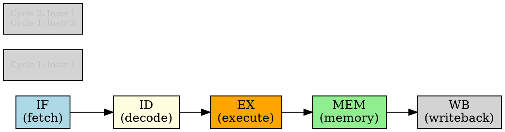

# Pipelining

## The Problem
A CPU instruction takes multiple steps (fetch, decode, execute, memory, writeback). If we wait for one instruction to finish before starting the next, the CPU is mostly idle — each stage is only used 1/5 of the time.

## Core Idea
Pipelining overlaps multiple instructions in execution — while one instruction is executing, the next is being decoded, and the one after is being fetched, like an assembly line.

## How It Works
1. Divide instruction execution into stages: IF (fetch) → ID (decode) → EX (execute) → MEM (memory) → WB (writeback)
2. Each stage processes a different instruction simultaneously
3. New instruction enters pipeline each clock cycle (after pipeline is full)
4. Throughput = 1 instruction per cycle (after initial fill)
5. RISC pipelines easily (fixed-length, simple instructions); CISC harder (variable-length, multi-cycle)

## Key Properties
- Throughput up to 1 instruction per clock cycle (ideal case)
- RISC enables easy pipelining (fixed-length, simple instructions)
- Pipeline depth: more stages = finer granularity but more overhead
- Hazards can stall pipeline: data hazards, control hazards, structural hazards

## Connections
- **Built from:** [[risc-architecture|RISC Architecture]], [[clock-cycle|Clock Cycle]]
- **Contrasts with:** [[cisc-architecture|CISC Architecture]] — harder to pipeline due to complex instructions
- **Related:** [[instruction-set|Instruction Set]], [[cpu|CPU]]
- **Builds into:** [[superscalar|Superscalar]] — multiple pipelines in parallel

## Edge Cases & Gotchas
- Pipeline stalls: when next instruction can't proceed (dependencies, branches)
- Branch prediction: need to guess which way a branch goes to keep pipeline full
- Pipeline flush: when a branch is mispredicted, partially executed instructions must be discarded
- RISC pipelines are deeper (more stages) than CISC (which are often translated to micro-ops first)

## Sources
- [[computer-architecture-summary|Computer Architecture Source Summary]]
