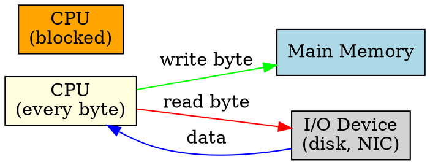

## The Problem
Without DMA, the CPU must handle every byte of data transferred between I/O devices and memory. For large transfers like disk reads or network packets, this wastes CPU cycles on simple copy operations, leaving no time for actual computation.

## Core Idea
Programmed I/O is a method where the CPU actively participates in every byte/word transfer between I/O devices and memory, using special I/O instructions or memory-mapped I/O reads/writes.

## How It Works
1. CPU issues a read/write command to the I/O device
2. CPU polls the device status register to check if ready
3. For each byte/word: CPU reads from device → writes to memory (or vice versa)
4. CPU repeats step 3 for the entire data block
5. CPU is fully occupied during the entire transfer — no other work can be done

## Key Properties
- CPU is blocked during entire transfer — cannot do other work
- Simple to implement — no special hardware needed beyond basic I/O interface
- Slow for large transfers — each byte requires CPU intervention
- CPU overhead is proportional to data size

## Connections
- **Contrasts with:** [[dma|DMA]] — DMA frees CPU during transfer, Programmed I/O keeps CPU busy
- **Built from:** [[io-system|I/O System]], [[device-controller|Device Controller]]
- **Builds into:** [[io-request-to-hardware|I/O Request to Hardware Operation]] (when DMA not available)
- **Related:** [[polling|Polling]] — CPU busy-waits for device ready

## Edge Cases & Gotchas
- For very small data sizes, Programmed I/O can be faster than DMA setup overhead
- Some embedded systems use Programmed I/O exclusively (no DMA controller)
- CPU cache effects: repeated loads/stores may pollute cache during PIO

## Sources
- [[computer-architecture-summary|Computer Architecture Source Summary]]
