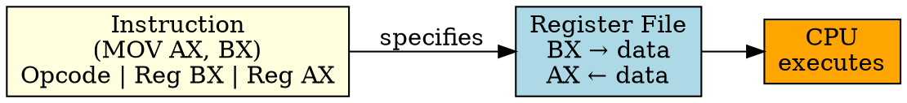

# Register Addressing

## The Problem
Memory accesses are slow (tens to hundreds of CPU cycles). Accessing operands from memory for every instruction would severely limit CPU performance. We need faster storage for frequently used values.

## Core Idea
Register Addressing specifies a CPU register as the operand location. The CPU reads/writes the register directly — no memory access needed, making it the fastest addressing mode.

## How It Works
1. Instruction specifies register name (e.g., AX, BX, R1, R2)
2. CPU accesses the named register in the register file
3. No memory access required — registers are inside CPU
4. Example: `MOV AX, BX` — copies content of BX into AX
5. Typically 2-3 cycle operation (fetch, decode, execute)

## Key Properties
- Fastest addressing mode (no memory access, registers are in CPU)
- Limited number of registers (typically 16-32 general-purpose registers)
- Used for temporary values, loop counters, frequently accessed data
- RISC relies heavily on register addressing (load-store architecture)

## Connections
- **Built from:** [[addressing-mode|Addressing Mode]], [[cpu-register|CPU Register]]
- **Contrasts with:** [[immediate-addressing|Immediate Addressing]] — constant in instruction, not register
- **Related:** [[register-file|Register File]], [[load-store-architecture|Load-Store Architecture]]
- **Builds into:** [[arithmetic-instruction|Arithmetic Instruction]] — typically uses register operands

## Edge Cases & Gotchas
- Limited registers — compiler must manage register allocation carefully
- Register spilling: when no free registers, must spill to memory (slow)
- Some ISAs have special registers (stack pointer, program counter) with restrictions

## Sources
- [[computer-architecture-summary|Computer Architecture Source Summary]]
